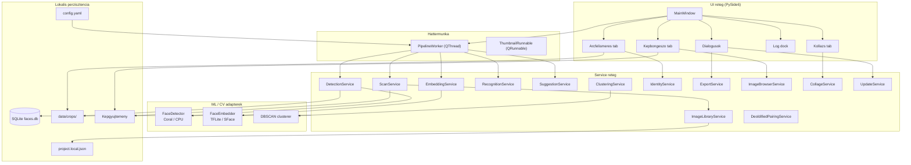
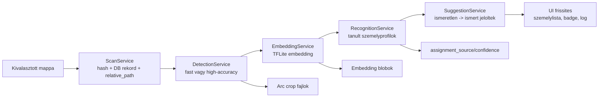
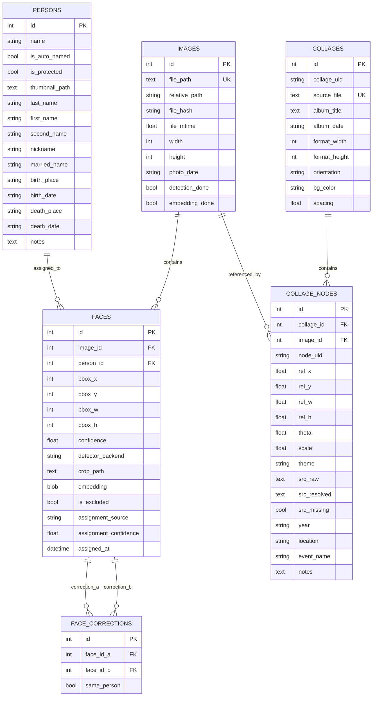
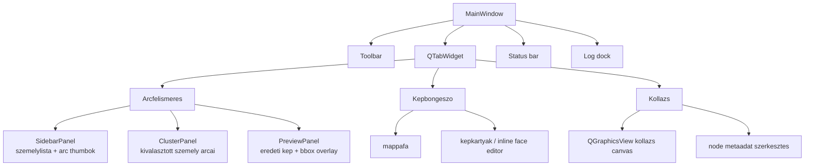

# Face-Local Blueprint

Aktuális alkalmazás-architektúra dokumentáció a jelenlegi kódbázishoz.

## 1. Áttekintés

Face-Local egy lokálisan futó, PySide6 alapú asztali alkalmazás családi vagy archív fotógyűjtemények feldolgozására. Képmappákat indexel, arcokat detektál, embeddingeket készít, személyeket tanul felhasználói címkékből, automatikus hozzárendeléseket és névjavaslatokat ad, valamint képböngésző, kollázs és export nézeteket biztosít.

Az alkalmazás nem felhőszolgáltatásra épül: az adatbázis, modellek, képkivágatok és projektbeállítások helyben maradnak.

### Fő technológiák

| Terület | Megoldás |
|---|---|
| Nyelv | Python 3.11+ |
| UI | PySide6 / Qt |
| Adatbázis | SQLite + SQLAlchemy ORM, WAL móddal |
| Detektálás | Coral Edge TPU TFLite, OpenCV DNN SSD, Haar fallback |
| Embedding | TFLite MobileFaceNet jellegű modell vagy OpenCV SFace |
| Felismerés | Koszinusz hasonlóság, személyprofilok, centroid + legjobb példa |
| Klaszterezés | scikit-learn DBSCAN, legacy / újraklaszterezési szerep |
| Képfeldolgozás | OpenCV, NumPy, Pillow |
| Konfiguráció | YAML + QSettings + `project.local.json` |
| Csomagolás | PyInstaller jellegű desktop build, Windows/Linux/macOS scriptek |

---

## 2. Magas szintű architektúra



### Aktuális pipeline

A fő feldolgozás már nem csak "scan -> detect -> embed -> cluster". A `PipelineWorker` jelenlegi futása:



Fontos: a DBSCAN klaszterezés továbbra is létezik (`ClusteringService`, `app/clustering/clusterer.py`), de a normál pipeline hangsúlya a korábban felcímkézett személyekből tanuló automatikus felismerésen van.

---

## 3. Belépési pont és indítás

**Fő fájl**: `app/main.py`

```bash
python -m app.main
python -m app.main --config config.yaml
python -m app.main --debug
python -m app.main --db /tmp/faces.db
```

Indításkor az alkalmazás:

1. feldolgozza a CLI argumentumokat,
2. beállítja a naplózást,
3. betölti a YAML konfigurációt,
4. létrehozza a Qt alkalmazást és a dark témát,
5. inicializálja a SQLite adatbázist,
6. lefuttatja az idempotens schema migrációkat,
7. inicializálja az `ImageLibraryService` singletonját,
8. biztosítja a védett `Ismeretlen` személyt,
9. felépíti a `MainWindow` UI-t,
10. elindítja az eseményciklust és háttérben frissítést ellenőriz.

---

## 4. Konfiguráció

**Fájl**: `app/config.py`

### Konfigurációs források

Betöltési sorrend:

1. explicit `--config`,
2. `FACE_LOCAL_CONFIG`,
3. `config.yaml`,
4. `config.example.yaml`,
5. frozen app esetén user config és bundle fallbackek.

Relatív utak a config fájl könyvtárához képest oldódnak fel. Frozen buildben az alapértelmezett írható storage útvonalak a felhasználói adatkönyvtárba kerülnek.

### AppConfig

| Mező | Leírás |
|---|---|
| `detection` | detektor küszöbök, modellek, high-accuracy paraméterek |
| `embedding` | embedding modell, bemeneti méret, dimenzió |
| `clustering` | DBSCAN paraméterek |
| `recognition` | automatikus felismerés küszöbei és profilépítés |
| `suggestions` | névjavaslatok küszöbe és darabszáma |
| `storage` | SQLite DB és crop könyvtár |
| `scan` | támogatott képformátumok, thumbnail méret |
| `base_dir` | relatív utak alapja |

### Lényeges alapértékek

```yaml
detection:
  confidence_threshold: 0.65
  min_face_size: 50
  high_accuracy_confidence_threshold: 0.25
  iou_merge_threshold: 0.35

embedding:
  input_size: [112, 112]
  embedding_dim: 192

recognition:
  auto_assign_threshold: 0.72
  min_margin: 0.08
  min_examples_per_person: 1
  centroid_weight: 0.70
  use_recognized_faces_for_training: true
  profile_auto_min_confidence: 0.85

suggestions:
  similarity_threshold: 0.5
  max_suggestions_per_person: 3
```

---

## 5. Adatmodell

**Fájlok**: `app/db/models.py`, `app/db/database.py`



### Migrációs stratégia

Nincs külön migration framework. Az `init_db()`:

- létrehozza a hiányzó táblákat `Base.metadata.create_all()` hívással,
- `PRAGMA table_info` alapján idempotensen hozzáadja az új oszlopokat,
- bekapcsolja a WAL, foreign key és normal synchronous módot,
- inicializálja a hordozható képgyűjtemény-kezelést.

Jelenleg kézzel migrált újabb oszlopok:

- `persons`: strukturált személyadatok, `is_protected`,
- `images`: `photo_date`, `relative_path`,
- `faces`: `assignment_source`, `assignment_confidence`, `assigned_at`.

---

## 6. Hordozható képgyűjtemény

**Fájl**: `app/services/image_library_service.py`

A projekt már kezeli azt az esetet, amikor ugyanazt az adatbázist másik gépen vagy más mount point alatt nyitják meg.

### Alapötlet

| Elem | Szerep |
|---|---|
| `Image.file_path` | eredeti abszolút út, legacy kompatibilitás |
| `Image.relative_path` | POSIX stílusú út a képgyűjtemény rootjához képest |
| `project.local.json` | gépspecifikus local config a DB mellett |
| `image_library_root` | aktuális gépen érvényes képgyűjtemény gyökér |

### Feloldási sorrend

1. `relative_path` + `image_library_root`,
2. legacy `file_path`,
3. `None`, ha a kép nem feloldható.

A képböngésző és a preview panelek az `ImageLibraryService.resolve_path()` logikáját használják, ahol lehet.

---

## 7. Service réteg

| Service | Felelősség |
|---|---|
| `ScanService` | képek rekurzív keresése, hash, méret, DB rekord, `relative_path` |
| `DetectionService` | arcok detektálása, high-accuracy többmenetes mód, crop mentés |
| `EmbeddingService` | pending arcok embeddingjeinek előállítása |
| `RecognitionService` | felcímkézett személyekből profilépítés és automatikus hozzárendelés |
| `SuggestionService` | automatikusan nevezett személyek összevetése ismert személyekkel |
| `ClusteringService` | DBSCAN alapú klaszterezés / újraklaszterezés |
| `IdentityService` | átnevezés, merge, törlés, reassign, kézi korrekciók |
| `ImageBrowserService` | mappa- és képösszefoglalók a böngésző tabhoz |
| `ImageLibraryService` | hordozható útvonalkezelés |
| `FaceCropService` | stabil crop fájlnevek, crop újragenerálás, thumbnail frissítés |
| `CollageService` | Picasa `.cxf/.cfx` import, render, arc-projekció |
| `CollageParser` | kollázs XML parse és node geometria |
| `DeoldifiedPairingService` | deoldified fájlok eredeti párjainak felismerése |
| `ExportService` | CSV, JSON, HTML, képfájl exportok |
| `UpdateService` | GitHub release ellenőrzés, asset letöltés, platformfüggő update |

---

## 8. ML és képfeldolgozás

### Detektorok

**Fájlok**: `app/detectors/*`

- `FaceDetector`: absztrakt interfész.
- `CoralDetector`: Edge TPU TFLite modell, ha pycoral és eszköz elérhető.
- `CpuDetector`: OpenCV DNN SSD, fallbackként Haar cascade.
- `factory.py`: Coral probe és megfelelő backend kiválasztása.

### High-accuracy detektálás

A `DetectionService` opcionális high-accuracy módban alacsonyabb küszöböt és több preprocessing variánst használ, majd IoU alapján összevonja az átfedő találatokat. Ez régi, fekete-fehér vagy rossz minőségű fotóknál fontos.

### Embeddingek

**Fájlok**: `app/embeddings/*`

- `TFLiteEmbedder`: CPU-n futó TFLite embedding modell.
- `SFaceEmbedder`: OpenCV SFace / ONNX alapú alternatíva.
- `Face.set_embedding()` és `Face.get_embedding()` float32 blobként tárol és olvas.

### Felismerés

**Fájl**: `app/services/recognition_service.py`

A felismerő személyprofilokat épít megbízható arcokból. A pontszám a személy centroidja és a legjobb egyedi példa között súlyozott koszinusz hasonlóság. Automatikus hozzárendelés csak akkor történik, ha:

- a legjobb pontszám eléri az `auto_assign_threshold` értéket,
- a legjobb és második legjobb jelölt közti különbség eléri a `min_margin` értéket,
- van elég tanító példa az adott személyhez,
- a személy nem védett vagy a művelet szabályai ezt nem tiltják.

---

## 9. UI felépítés

**Fő fájl**: `app/ui/main_window.py`



### Fő toolbar műveletek

- képgyűjtemény mappa kiválasztása,
- scan mód választása,
- pipeline megállítása,
- export,
- arcnélküli képek / kézi arcjelölés,
- névjavaslatok,
- beállítások.

### Fontos dialógusok

| Dialógus | Feladat |
|---|---|
| `SettingsDialog` | DB út, TPU státusz, beállítások |
| `ScanModesDialog` | gyors vagy high-accuracy scan |
| `ManualMarkDialog` | kézi arc hozzáadása képen |
| `NoFaceImagesDialog` | arcnélküli képek átnézése |
| `SuggestionDialog` | névjavaslatok elfogadása / elutasítása |
| `PersonInfoDialog` | strukturált személyadatok szerkesztése |
| `RenameDialog` | személy átnevezése |
| `MergeDialog` | személyek összevonása |
| `ExportDialog` | export formátum és cél kiválasztása |
| `ImageLibraryMissingDialog` | hiányzó image library root kezelése |
| `MigrateLibraryDialog` | legacy abszolút utak migrálása relatív utakra |
| `CollageNodeDialog` | kollázs node metaadatok |
| `TpuStatusDialog` | TPU diagnosztika és telepítési segítség |
| `UpdateDialog` | release asset letöltés és update |

---

## 10. Export és kollázs

### Export

**Fájl**: `app/services/export_service.py`

Az export szolgáltatás többféle kimenetet állít elő:

- személyek és arcok CSV/JSON riportjai,
- HTML nézet,
- képek vagy arc-kivágatok mappába másolása,
- bbox és relatív koordináta segédadatok.

### Kollázs

**Fájlok**: `app/services/collage_parser.py`, `app/services/collage_service.py`, `app/ui/panels/collage_panel.py`

A kollázs alrendszer Picasa jellegű `.cxf/.cfx` fájlokat olvas. A node-ok relatív koordinátáit, forgatását, zoomját és forrásútvonalát adatbázisba menti, majd renderelhető kollázsnézetet és az arcok kollázsra vetítését biztosítja.

---

## 11. Csomagolás és kiadás

Kapcsolódó fájlok:

- `scripts/package_app.py`,
- `scripts/build_and_run.sh`,
- `scripts/build_and_run.ps1`,
- `scripts/build_and_run.bat`,
- `scripts/build_linux_deb.sh`,
- `scripts/build_windows_installer.iss`,
- `scripts/github_release.py`,
- `scripts/post_x_release.py`,
- `scripts/post_buffer_release.py`.

A projekt tartalmaz platformikonokat (`assets/icons`) és release automatizálási segédeket. Az `UpdateService` GitHub release asseteket tud ellenőrizni és platformfüggően alkalmazni.

---

## 12. Tesztek

**Könyvtár**: `tests/`

A tesztcsomag lefedi többek között:

- konfiguráció betöltését,
- adatbázis és schema viselkedést,
- detektálás, embedding, klaszterezés, felismerés service-eket,
- scan és image library logikát,
- képböngésző szolgáltatást,
- kollázs parse-t,
- deoldified párosítást,
- exportot,
- suggestion workflow-t,
- release posztoló scripteket.

Futtatás:

```bash
pytest
```

---

## 13. Fejlesztési irányelvek

- A DB schema változásainál frissíteni kell az ORM modelleket és az idempotens `_migrate_add_columns()` listát.
- Új képútvonalat kezelő funkciónál a `file_path` helyett lehetőség szerint az `ImageLibraryService` resolverét kell használni.
- Új automatikus hozzárendelésnél mindig tölteni kell az `assignment_source`, `assignment_confidence`, `assigned_at` mezőket.
- UI műveleteknél a védett `Ismeretlen` személyt nem szabad átnevezni vagy törölni.
- Kézi arc- vagy bbox-módosítás után a cropot és a személy thumbnailt is konzisztensen kell frissíteni.
- Hosszabb futású munkát Qt workerben vagy QRunnable-ben kell végezni, nem a GUI szálon.
- Exportnál és kollázsnál figyelni kell a hordozható image library root hiányára.

