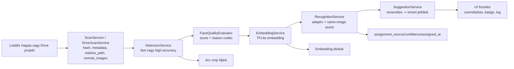
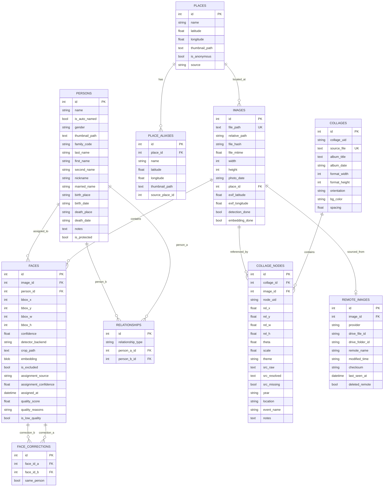
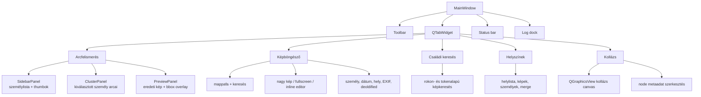

# Face-Local Blueprint

Aktuális alkalmazás-architektúra dokumentáció a jelenlegi kódbázishoz.

## 1. Áttekintés

A Face-Local lokálisan futó, PySide6 alapú asztali alkalmazás családi és archív fotógyűjtemények feldolgozására. Képmappákat vagy Google Drive projektmappát indexel, arcokat detektál, embeddingeket készít, személyeket tanul felhasználói címkékből, automatikus hozzárendeléseket és névjavaslatokat ad, majd személy-, kép-, családi-, helyszín-, kollázs- és export nézetekben teszi kezelhetővé az archívumot.

Az alap működés lokális: az SQLite adatbázis, a cropok, a modellek és a beállítások helyben vannak. A Google Drive funkció opcionális projekt-sync és távoli képforrás réteg, nem kötelező felhő backend.

### Fő technológiák

| Terület | Megoldás |
|---|---|
| Nyelv | Python 3.11+ |
| UI | PySide6 / Qt |
| Adatbázis | SQLite + SQLAlchemy ORM, WAL móddal |
| Detektálás | Coral Edge TPU TFLite, OpenCV DNN SSD, Haar fallback |
| Embedding | TFLite MobileFaceNet jellegű modell, OpenCV SFace alternatíva |
| Felismerés | Koszinusz hasonlóság, személyprofilok, centroid + legjobb példa |
| Klaszterezés | scikit-learn DBSCAN, korrekciókkal támogatott re-cluster |
| Képfeldolgozás | OpenCV, NumPy, Pillow, EXIF orientáció/GPS |
| Konfiguráció | YAML + QSettings + `project.local.json` + Drive prefs |
| Távoli mód | Google Drive OAuth, Drive API, lock/heartbeat alapú projekt-session |
| Csomagolás | PyInstaller jellegű desktop build, Windows/Linux/macOS scriptek |

---

## 2. Magas szintű architektúra

```mermaid
flowchart TB
    subgraph UI["UI réteg (PySide6)"]
        MW["MainWindow"]
        FACE["Arcfelismerés"]
        BROWSER["Képböngésző"]
        FAMILY["Családi keresés"]
        PLACES["Helyszínek"]
        COLLAGE["Kollázs"]
        LOG["Log dock"]
        DIALOGS["Dialógusok"]
    end

    subgraph WORKERS["Háttérmunka"]
        PIPE["PipelineWorker (QThread)"]
        THUMB["ThumbnailRunnable (QRunnable)"]
        DRIVEIMG["DriveThumb/FetchRunnable"]
    end

    subgraph SERVICES["Service réteg"]
        SCAN["ScanService / DriveScanService"]
        DET["DetectionService"]
        QUALITY["FaceQualityEvaluator"]
        EMB["EmbeddingService"]
        REC["RecognitionService"]
        SUG["SuggestionService"]
        CLUS["ClusteringService"]
        ID["IdentityService"]
        FAMILY_SVC["FamilyService"]
        PLACE_SVC["PlaceService"]
        EXPORT["ExportService"]
        IMG_LIB["ImageLibraryService"]
        BROWSE["ImageBrowserService"]
        COLL_SVC["CollageService"]
        DUP["DuplicateUnknownFaceFinder"]
        UPDATE["UpdateService"]
        DEOLD["DeoldifiedPairingService"]
    end

    subgraph GDRIVE["Google Drive réteg"]
        GCLIENT["GoogleDriveClient"]
        AUTH["OAuth + CredentialStore"]
        PROJ["GDriveProjectSession"]
        CACHE["GDriveCacheManager"]
        PROVIDER["StorageProvider"]
    end

    subgraph ML["ML / CV adapterek"]
        DETECTOR["FaceDetector\nCoral / CPU"]
        EMBEDDER["FaceEmbedder\nTFLite / SFace"]
        DBSCAN["DBSCAN clusterer"]
    end

    subgraph DATA["Perzisztencia"]
        DB[("SQLite faces.db")]
        CROPS["data/crops/"]
        LOCAL["project.local.json"]
        CONFIG["config.yaml"]
        IMAGES["Lokális képgyűjtemény"]
        DRIVE["Drive projektmappa"]
    end

    MW --> FACE
    MW --> BROWSER
    MW --> FAMILY
    MW --> PLACES
    MW --> COLLAGE
    MW --> LOG
    MW --> DIALOGS
    MW --> PIPE

    FACE --> ID
    FACE --> CLUS
    BROWSER --> BROWSE
    BROWSER --> PLACE_SVC
    BROWSER --> DEOLD
    FAMILY --> FAMILY_SVC
    PLACES --> PLACE_SVC
    COLLAGE --> COLL_SVC
    DIALOGS --> EXPORT
    DIALOGS --> UPDATE
    DIALOGS --> AUTH

    PIPE --> SCAN
    PIPE --> DET
    PIPE --> EMB
    PIPE --> REC
    PIPE --> SUG

    SCAN --> IMG_LIB
    SCAN --> GCLIENT
    DET --> DETECTOR
    DET --> QUALITY
    EMB --> EMBEDDER
    CLUS --> DBSCAN
    DRIVEIMG --> CACHE

    SERVICES --> DB
    DET --> CROPS
    FACE --> CROPS
    BROWSER --> IMAGES
    IMG_LIB --> LOCAL
    GDRIVE --> DRIVE
    CONFIG --> PIPE
```



### Aktuális pipeline

A fő pipeline jelenleg öt szakaszos:



Fontos: a normál futás felismerés-központú. A DBSCAN klaszterezés továbbra is létezik re-cluster és legacy munkafolyamatként, kézi same/different korrekciókkal.

---

## 3. Belépési pont és indítás

**Fő fájl**: `app/main.py`

```bash
python -m app.main
python -m app.main --config config.yaml
python -m app.main --debug
python -m app.main --db /tmp/faces.db
```

Indításkor az alkalmazás:

1. feldolgozza a CLI argumentumokat,
2. beállítja a naplózást és a Qt log handlert,
3. betölti a YAML konfigurációt,
4. létrehozza a Qt alkalmazást és a témát,
5. inicializálja a SQLite adatbázist,
6. lefuttatja az idempotens schema migrációkat,
7. inicializálja az `ImageLibraryService` singletonját,
8. biztosítja a védett `Ismeretlen` személyt,
9. felépíti a `MainWindow` UI-t,
10. elindítja az eseményciklust és háttérben frissítést ellenőriz.

---

## 4. Konfiguráció

**Fájl**: `app/config.py`

Betöltési sorrend:

1. explicit `--config`,
2. `FACE_LOCAL_CONFIG`,
3. fejlesztői módban `config.yaml`, majd `config.example.yaml`,
4. frozen app esetén user config, bundle config és bundle example fallbackek.

Relatív utak a config fájl könyvtárához képest oldódnak fel. Frozen buildben az alapértelmezett írható storage útvonalak a felhasználói adatkönyvtárba kerülnek.

### AppConfig mezők

| Mező | Leírás |
|---|---|
| `detection` | detektor küszöbök, CPU/Coral modellek, high-accuracy és duplikált-ismeretlen IoU |
| `embedding` | embedding modell, bemeneti méret, dimenzió |
| `clustering` | DBSCAN paraméterek |
| `recognition` | automatikus felismerés, adaptív küszöb és same-image assist |
| `suggestions` | névjavaslatok küszöbe és darabszáma |
| `storage` | SQLite DB és crop könyvtár |
| `scan` | támogatott képformátumok, worker szám, thumbnail méret |
| `base_dir` | relatív utak alapja |

### Lényeges alapértékek

```yaml
detection:
  confidence_threshold: 0.65
  min_face_size: 50
  high_accuracy_confidence_threshold: 0.25
  iou_merge_threshold: 0.35
  duplicate_unknown_iou_threshold: 0.35

embedding:
  input_size: [112, 112]
  embedding_dim: 192

recognition:
  auto_assign_threshold: 0.72
  min_margin: 0.08
  min_examples_per_person: 1
  centroid_weight: 0.70
  use_recognized_faces_for_training: true
  profile_auto_min_confidence: 0.85
  adaptive_threshold_enabled: true
  adaptive_min_threshold: 0.55
  same_image_assist_enabled: true
  same_image_assist_threshold: 0.62
  same_image_assist_min_confirmed: 1
  same_image_assist_margin: 0.05

suggestions:
  similarity_threshold: 0.5
  max_suggestions_per_person: 3
```

---

## 5. Adatmodell

**Fájlok**: `app/db/models.py`, `app/db/database.py`



### Migrációs stratégia

Nincs külön migration framework. Az `init_db()`:

- létrehozza a hiányzó táblákat `Base.metadata.create_all()` hívással,
- `PRAGMA table_info` alapján idempotensen hozzáadja az új oszlopokat,
- létrehozza a szükséges indexeket,
- bekapcsolja a WAL, foreign key és normal synchronous módot,
- migrálja a régi kollázs-helyszín mezőket a `places` táblához,
- inicializálja a hordozható képgyűjtemény-kezelést.

Kézzel migrált mezőcsoportok: strukturált személyadatok, `family_code`, `gender`, védett személyek, képek relatív útja és EXIF GPS adatai, arc assignment metaadatok, arcminőség mezők, helyszínek, kapcsolatok, remote image metadata.

---

## 6. Hordozható képgyűjtemény

**Fájl**: `app/services/image_library_service.py`

A projekt kezeli azt az esetet, amikor ugyanazt az adatbázist másik gépen vagy más mount point alatt nyitják meg.

| Elem | Szerep |
|---|---|
| `Image.file_path` | eredeti abszolút út, legacy kompatibilitás |
| `Image.relative_path` | POSIX stílusú út a képgyűjtemény rootjához képest |
| `project.local.json` | gépspecifikus local config a DB mellett |
| `image_library_root` | aktuális gépen érvényes képgyűjtemény gyökér |

Feloldási sorrend:

1. `relative_path` + `image_library_root`,
2. legacy `file_path`,
3. `None`, ha a kép nem feloldható.

Az `ImageLibraryService` emellett közös rootot detektál, relatív utakra migrál, ellenőrzi a root elérhetőségét, és a scan közben képes régi abszolút rekordokat relatív út alapján újralinkelni.

---

## 7. Google Drive mód

**Fájlok**: `app/gdrive/*`, `app/ui/dialogs/gdrive_settings_tab.py`, `app/workers/drive_image_worker.py`

A Drive integráció opcionális, két fő feladatot lát el:

- Drive projektmappa megnyitása és a projekt DB szinkronizálása,
- Drive-on lévő képek listázása, lokális mirror/cache kezelése és indexelése.

### Fő komponensek

| Komponens | Felelősség |
|---|---|
| `oauth_config.py` | Google OAuth client konfiguráció ellenőrzése |
| `oauth_flow.py` | böngészős bejelentkezés, account email lekérése |
| `credential_store.py` | token tárolás keyringben vagy titkosított fallback fájlban |
| `drive_client.py` | Drive API wrapper retry logikával |
| `preferences.py` | account, folder, Drive mód és DB sync QSettings preferenciák |
| `project_session.py` | projektmappa struktúra, DB letöltés/feltöltés, lock, heartbeat |
| `drive_scan_service.py` | Drive képek rekurzív indexelése és mirror frissítés |
| `storage_provider.py` | lokális és Drive képforrás egységes protokollja |
| `cache.py` | átmeneti Drive fájl cache, méretlimit és cleanup |
| `db_sync.py` | régebbi/egyszerűbb DB sync wrapper |
| `connectivity.py` | online/offline guard |
| `folder_url.py` | Drive folder URL vagy ID parse |

### Projekt-session

A `GDriveProjectSession`:

1. feloldja vagy létrehozza a projekt almappáit,
2. biztosítja a projekt descriptor fájlt,
3. lockot szerez, stale lockot felismer,
4. letölti vagy inicializálja a projekt SQLite DB-t,
5. heartbeatet frissít,
6. záráskor checkpointolja és feltölti a DB-t,
7. felszabadítja a lockot.

A `MainWindow` Drive toolbar gombja a beállításoktól függően nyitja vagy zárja a Drive projektet. Drive módban a pipeline a letöltött DB override útvonalon dolgozik.

---

## 8. Service réteg

| Service | Felelősség |
|---|---|
| `ScanService` | lokális képek rekurzív keresése, hash, méret, EXIF GPS, DB rekord, `relative_path` |
| `DriveScanService` | Drive képek listázása, letöltése/mirrorozása, `RemoteImage` rekordok frissítése |
| `DetectionService` | arcok detektálása, high-accuracy többmenetes mód, crop mentés, arcminőség |
| `EmbeddingService` | pending arcok embeddingjeinek előállítása, alacsony minőség opcionális kihagyása |
| `RecognitionService` | felcímkézett személyekből profilépítés, adaptív felismerés, same-image assist |
| `SuggestionService` | automatikusan nevezett személyek összevetése ismert személyekkel, accept/reject |
| `ClusteringService` | DBSCAN alapú klaszterezés és re-cluster, same/different korrekciókkal |
| `IdentityService` | átnevezés, merge, törlés, reassign, kizárás, kézi korrekciók |
| `FamilyService` | családi kódok, kapcsolatok, rokonleírások, családi képfeltételek szerinti keresés |
| `PlaceService` | helyszínek létrehozása, EXIF GPS kapcsolás, közeli helyek, merge, thumbnail |
| `ImageBrowserService` | mappa- és képösszefoglalók a böngésző tabhoz |
| `ImageLibraryService` | hordozható útvonalkezelés és migráció |
| `FaceCropService` | stabil crop fájlnevek, crop újragenerálás, thumbnail frissítés |
| `FaceQualityEvaluator` | confidence, méret, blur és aspect ratio alapú minősítés |
| `DuplicateUnknownFaceFinder` | ismert arcokra rálógó ismeretlen boxok keresése és törlése |
| `CollageService` | Picasa `.cxf/.cfx` import, render, arc-projekció, annotált export |
| `CollageParser` | kollázs XML parse, sérült XML recover, node geometria |
| `DeoldifiedPairingService` | colorized/deoldified fájlok eredeti párjainak felismerése |
| `ExportService` | személy/kép/arc CSV, JSON, HTML, képfájl és kollázs HTML export |
| `UpdateService` | GitHub release ellenőrzés, asset letöltés, platformfüggő update |

---

## 9. ML és képfeldolgozás

### Detektorok

**Fájlok**: `app/detectors/*`

- `FaceDetector`: absztrakt interfész.
- `CoralDetector`: Edge TPU TFLite modell, ha pycoral és eszköz elérhető.
- `CpuDetector`: OpenCV DNN SSD, fallbackként Haar cascade.
- `factory.py`: Edge TPU library/device probe, macOS USB visibility check és megfelelő backend kiválasztása.

### High-accuracy detektálás

A `DetectionService` opcionális high-accuracy módban alacsonyabb küszöböt és több preprocessing variánst használ. Tipikus variánsok: eredeti kép, CLAHE, hisztogramkiegyenlítés, gamma, bilateral. Az átfedő találatok IoU alapján deduplikálódnak.

A detektálás EXIF orientációt normalizál, perceptual dHash diagnosztikát ír, és Coral hiba esetén CPU detektorra tud visszaesni.

### Arcminőség

**Fájl**: `app/services/face_quality_service.py`

Az arcminőség extra modell nélkül számolódik:

- alacsony detector confidence,
- túl kicsi bbox,
- blur Laplacian varianciával,
- szokatlan bbox aspect ratio.

Az eredmény `quality_score`, `quality_reasons` és `is_low_quality`. A pipeline QSettings alapján kihagyhatja az alacsony minőségű arcokat embedding/felismerés/suggestion szakaszban, miközben kézi hozzárendelések továbbra is használhatók.

### Embeddingek

**Fájlok**: `app/embeddings/*`

- `TFLiteEmbedder`: CPU-n futó TFLite embedding modell.
- `SFaceEmbedder`: OpenCV SFace / ONNX alternatíva, grayscale enhancementtel.
- `Face.set_embedding()` és `Face.get_embedding()` float32 blobként tárol és olvas.

### Felismerés

**Fájl**: `app/services/recognition_service.py`

A felismerő nem mozgat már megbízhatóan felcímkézett, nem védett személyhez tartozó arcokat. Profilokat épít kézi, legacy, suggestion-approved és nagyon biztos automatikus arcokból. A pontszám a centroid és a legjobb egyedi példa súlyozott koszinusz hasonlósága.

Két passz van:

1. adaptív threshold a face quality, bbox méret és aspect ratio alapján,
2. same-image assist, amikor ugyanazon a képen már van kézzel megerősített személy, ezért a jelöltkészlet biztonságosan szűkíthető.

Automatikus hozzárendelés csak erős pontszám, megfelelő margin és elegendő tanító példa esetén történik. Az eredmény mindig tölti az assignment metaadatokat.

---

## 10. UI felépítés

**Fő fájl**: `app/ui/main_window.py`



### Fő toolbar műveletek

- képgyűjtemény mappa kiválasztása,
- scan mód választása,
- pipeline megállítása,
- export,
- arcnélküli képek és kézi arcjelölés,
- névjavaslatok,
- beállítások,
- Google Drive projekt nyitás/zárás.

### Arcfelismerés tab

- személylista kereséssel és hover preview-val,
- személy arcainak thumbnail gridje,
- eredeti kép preview bbox overlay-jel,
- személy átnevezése, merge, törlése,
- face eltávolítás clusterből, reassign, exclude,
- személyadatok szerkesztése,
- re-cluster indítás,
- jobbklikk és preview műveletek.

### Képböngésző tab

- mappafa, mappakeresés és képkeresés,
- nagy kép nézet zoom/pan/fullscreen móddal,
- arc bbox overlay és kézi bbox rajzolás,
- inline személy hozzárendelés vagy új személy létrehozás,
- arc bbox módosítás és törlés,
- kép dátum kezelése,
- EXIF GPS javaslat elfogadása,
- helyszín keresés, létrehozás, hozzárendelés, átnevezés,
- deoldified/original párok közötti váltás,
- Drive thumbnail/fetch támogatás.

### Családi keresés tab

- személyek keresése családi kód, név és strukturált mezők alapján,
- szülő/gyerek/házastárs/testvér/ág jellegű kapcsolati szűrések,
- több személyt tartalmazó képek keresése,
- lapozott találati lista,
- keresési javaslatok.

### Helyszínek tab

- helyek listázása szűrőkkel,
- névvel vagy EXIF-ből létrejött anonim helyek kezelése,
- helyhez tartozó képek és személyek összefoglalása,
- közeli helyek felismerése,
- helyek összevonása alias megőrzéssel.

### Kollázs tab

- Picasa `.cxf/.cfx` import,
- kollázs választás, zoom, fit, face overlay kapcsoló,
- node metaadat szerkesztés,
- arcok kollázs koordinátára vetítése,
- annotált kollázs és kollázs HTML export.

### Fontos dialógusok

| Dialógus | Feladat |
|---|---|
| `SettingsDialog` | DB út, TPU státusz, minőségszűrés, Drive beállítások |
| `GDriveSettingsTab` | Google login/logout, Drive folder választás, Drive mód, DB sync, cache törlés |
| `ScanModesDialog` | gyors, high-accuracy és rescan módok |
| `ManualMarkDialog` | kézi arc hozzáadása képen |
| `NoFaceImagesDialog` | arcnélküli képek átnézése |
| `OverlappingUnknownFacesDialog` | ismert arcokra rálógó ismeretlen boxok törlése |
| `SuggestionDialog` | névjavaslatok elfogadása / elutasítása |
| `PersonInfoDialog` | strukturált személyadatok, nem, családi kód |
| `RenameDialog` | személy átnevezése |
| `MergeDialog` | személyek összevonása |
| `PlaceMergeDialog` | helyek összevonása |
| `ExportDialog` | export formátum és cél kiválasztása |
| `ImageLibraryMissingDialog` | hiányzó image library root kezelése |
| `MigrateLibraryDialog` | legacy abszolút utak migrálása relatív utakra |
| `CollageNodeDialog` | kollázs node metaadatok |
| `TpuStatusDialog` | TPU diagnosztika és telepítési segítség |
| `UpdateDialog` | release asset letöltés és update |

---

## 11. Keresés, családfa és helyszínek

### Személykeresés

**Fájlok**: `app/utils/person_search.py`, `app/ui/widgets/person_search_select.py`

A személykeresés normalizált, több mezős keresést használ. A találatoknál a név mellett a strukturált mezők, becenév, házassági név és családi kód is releváns.

### Családi kódok és kapcsolatok

**Fájl**: `app/services/family_service.py`

A családi szolgáltatás:

- normalizálja és validálja a családi kódokat,
- parse-olja a családgyökeret, generációt, házastárs jelölést,
- listáz gyerekeket, testvéreket, ágakat,
- tárolt kapcsolatokat kezel: `ParentChild`, `Spouse`,
- testvérséget részben származtatott módon kezel,
- kapcsolatleírást ad két személy között,
- képeket keres személyek, kapcsolatok és strukturált mezők alapján.

### Helyszínek

**Fájlok**: `app/services/place_service.py`, `app/utils/exif.py`

A scan EXIF GPS koordinátát olvas. Ha a képnek nincs helye, a `PlaceService` közeli meglévő helyhez kötheti, vagy anonim EXIF helyet hoz létre. A felhasználó ezeket később elnevezheti, összevonhatja vagy kézzel rendelheti képekhez.

---

## 12. Export és kollázs

### Export

**Fájl**: `app/services/export_service.py`

Az export szolgáltatás:

- személyekhez tartozó képek vagy cropok mappába másolása,
- CSV riport,
- JSON riport,
- önálló HTML galéria,
- kollázs HTML export,
- bbox pixeles és százalékos koordináták,
- személy-, kép-, dátum-, hely- és arcmetaadatok exportja,
- biztonságos fájlnevek és hordozható image resolver használata.

### Kollázs

**Fájlok**: `app/services/collage_parser.py`, `app/services/collage_service.py`, `app/ui/panels/collage_panel.py`

A kollázs alrendszer Picasa jellegű `.cxf/.cfx` fájlokat olvas. A parser képes sérült XML recoverre, Windows/Picasa útvonalak feloldására, relatív node geometriák és metaadatok parse-olására.

A `CollageService`:

- importálja és adatbázisba menti a kollázst,
- node-okat `Image` rekordokhoz linkel,
- rendereli a kollázst,
- arcokat vetít a kollázs node koordinátáira,
- annotált képet és annotált `.cxf`-et exportál,
- fájlnévből év/hely/esemény metaadatokat tud kinyerni.

---

## 13. Háttérmunkák és threading

| Worker | Feladat |
|---|---|
| `PipelineWorker` | scan -> detect -> embed -> recognize -> suggest pipeline QThreadben |
| `ThumbnailRunnable` | lokális thumbnail generálás QRunnable-ben |
| `DriveThumbRunnable` | Drive image thumbnail letöltés/generálás |
| `DriveFetchRunnable` | Drive kép lokális lekérése megnyitáshoz/szerkesztéshez |
| `_DownloadThread` | update asset letöltés |
| `_InstallerThread` | TPU telepítési parancsok futtatása |
| `_SignInThread` | Google OAuth login |
| `_FolderProbeThread` | Drive folder validálás |
| `_MigrationThread` | image library relatív út migráció |

Hosszú művelet nem futhat a GUI szálon. A háttérfolyamatok Qt signallal frissítik a progress bart, státuszt, logot és UI listákat.

---

## 14. Csomagolás, release és diagnosztika

Kapcsolódó fájlok:

- `scripts/package_app.py`,
- `scripts/build_and_run.sh`,
- `scripts/build_and_run.ps1`,
- `scripts/build_and_run.bat`,
- `scripts/build_linux_deb.sh`,
- `scripts/build_windows_installer.iss`,
- `scripts/github_release.py`,
- `scripts/post_x_release.py`,
- `scripts/post_buffer_release.py`,
- `app/diagnostics.py`.

A projekt tartalmaz platformikonokat (`assets/icons`) és release automatizálási segédeket. Az `UpdateService` GitHub release asseteket ellenőriz és platformfüggően letölt. A diagnosztikai modul TFLite backendeket vizsgál, a TPU dialógus Edge TPU library/device állapotot és javító parancsokat mutat.

---

## 15. Tesztek

**Könyvtár**: `tests/`

A tesztcsomag lefedi többek között:

- konfiguráció betöltését és DB út mentését,
- adatbázis és schema viselkedést,
- lokális scan és image library logikát,
- Google Drive dotenv, credential store, folder URL, storage provider, project session és drive scan réteget,
- detektorokat és TFLite embeddert,
- detektálás, embedding, klaszterezés, felismerés és suggestion service-eket,
- face crop és duplikált ismeretlen arc workflow-t,
- képböngésző szolgáltatást,
- helyszín- és családi szolgáltatásokat,
- deoldified párosítást,
- kollázs parse-t,
- exportot,
- release és social posztoló scripteket.

Futtatás:

```bash
pytest
```

---

## 16. Fejlesztési irányelvek

- DB schema változásnál frissíteni kell az ORM modelleket, az idempotens migrációkat és ezt a blueprintet.
- Új képútvonalat kezelő funkciónál a `file_path` helyett lehetőség szerint az `ImageLibraryService` resolverét kell használni.
- Drive képeknél a lokális fájl csak cache/mirror lehet; remote metadata a `RemoteImage` rekordban él.
- Új automatikus hozzárendelésnél mindig tölteni kell az `assignment_source`, `assignment_confidence`, `assigned_at` mezőket.
- UI műveleteknél a védett `Ismeretlen` személyt nem szabad átnevezni vagy törölni.
- Kézi arc- vagy bbox-módosítás után a cropot, embedding állapotot és személy thumbnailt is konzisztensen kell frissíteni.
- Helyszín merge esetén alias adatokat meg kell őrizni.
- Családi kapcsolatnál kerülni kell az önhivatkozást, duplikált házastárs rekordot és ciklikus parent-child láncot.
- Hosszabb futású munkát Qt workerben vagy QRunnable-ben kell végezni, nem a GUI szálon.
- Exportnál, kollázsnál, preview-nál és képböngészőnél kezelni kell a hiányzó image library rootot és a Drive fetch hibákat.
- Új UI szöveghez az `app/ui/i18n.py` kulcsait kell frissíteni.
