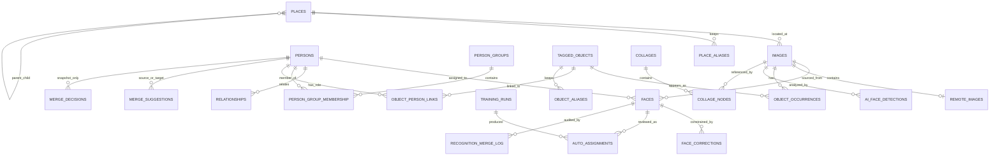

# Face-Local Blueprint

Frissítve: 2026-06-18

Ez a dokumentum a jelenlegi kodbazis architekturajat irja le. Nem user manual,
hanem fejlesztoi terkep: melyik domain hol lakik, milyen pipeline mozgatja az
adatokat, es mely contractokat kell megorizni, amikor uj funkcio vagy migracio
kerul a rendszerbe.

## 1. Rendszerkep

A Face-Local lokalisan futo, PySide6 alapu desktop alkalmazas csaladi es
archiv fotogyujtemenyek feldolgozasara. Kepeket indexel lokalis mappabol vagy
Google Drive projektbol, arcokat detektal, embeddingeket keszit, szemelyeket
tanul a felhasznaloi cimkekbol, ismeretlen arcokat klaszterez, merge- es
nevjavaslatokat ad, majd a teljes gyujtemenyt szemely, kep, csalad, hely,
targy, kollazs es export nezopontokbol teszi kezelhetove.

Az alapmodell privacy-first: az SQLite adatbazis, cropok, modellek,
beallitasok es exportok helyben vannak. A Google Drive integracio opcionális
projekt-sync es tavoli kepforras reteg, nem kotelezo felho backend.

### Fobb kepessegek

| Terulet | Jelenlegi allapot |
|---|---|
| Klasszikus arc pipeline | scan -> detect -> embed -> dedup -> recognize -> ignored filter -> unknown clustering -> consistency -> suggestions |
| AI/deep pipeline | rescan, rebuild, train-only es analysis-only face detection modok |
| Detektalas | Coral Edge TPU, OpenCV YuNet, OpenCV DNN SSD, Haar fallback |
| Embedding | TFLite CPU backend, OpenCV SFace fallback, HOG teszt fallback |
| Felismeres | prototipus/centroid alapu klasszikus felismeres es MLP ensemble alapu deep recognition |
| Adatkezeles | SQLite + SQLAlchemy ORM, WAL, idempotens schema migraciok |
| UI | PySide6/Qt tabok, dialogusok, QRunnable/QThread hattermunkak |
| Tavoli munka | Google Drive OAuth, Drive API, lock/heartbeat alapu projekt-session |
| Export | CSV/JSON/Excel metadata, kep/crop export, Astro statikus galeria, kollazs HTML, `.facepack` |
| Helyszin | EXIF GPS, strukturalt cim, opt-in Nominatim geokodolas, hierarchia |
| Targyak | manualis object tagging, elofordulasok, szemely-szerep kapcsolatok |
| Recording | ffmpeg alapu dokumentacios kepernyorogzites, timeline es metadata log |

### Technologiai stack

| Terulet | Megoldas |
|---|---|
| Nyelv | Python 3.11+ |
| Desktop UI | PySide6 / Qt |
| ORM | SQLAlchemy 2.x |
| DB | SQLite, WAL, foreign key enforcement, busy timeout |
| CV/ML | OpenCV, NumPy, Pillow, scikit-learn, ai-edge-litert/TFLite |
| Google Drive | google-auth, google-auth-oauthlib, google-api-python-client, keyring |
| Export galeria | Astro SSG + Node/npm a `web/astro` alatt |
| Spreadsheet export | openpyxl |
| Geocoding | Overpass API (opt-in), Nominatim fallback, cím-keresés cache |
| Képernyő rögzítés | ffmpeg audio/video + timeline log, segment-szintu mentés |
| Háttérfeladat menedzsment | TaskManager preemption, prioritási ütemezés, előzetes szakítás |
| Packaging | PyInstaller jellegu app build, macOS/Windows/Linux scriptek |
| Teszt | pytest, pytest-qt |

## 2. Magas szintu architektura

```mermaid
flowchart TB
    subgraph UI["PySide6 UI"]
        MW["MainWindow"]
        FACE["Arcfelismeres tab"]
        BROWSER["Kepbongeszo tab"]
        FAMILY["Csaladi kereses tab"]
        PLACES["Helyszinek tab"]
        PERSONS["Szemelyek tab"]
        GROUPS["Csoportok tab"]
        OBJECTS["Targyak tab"]
        COLLAGE["Kollazs tab"]
        SETTINGS["Dialogusok es beallitasok"]
    end

    subgraph WORKERS["Hattermunkak"]
        PIPE["PipelineWorker"]
        DEEP["DeepPipelineWorker"]
        REREC["ReRecognitionWorker"]
        MATCH["MatchJobWorker"]
        ASTRO["AstroExportWorker"]
        THUMB["Thumbnail/Drive QRunnable-ok"]
        GEO["Geocoding QRunnable-ok"]
        TASK["TaskManager\npreemption & scheduling"]
    end

    subgraph SERVICES["Service reteg"]
        SCAN["ScanService / DriveScanService"]
        DET["DetectionService"]
        EMB["EmbeddingService"]
        REC["RecognitionService"]
        DREC["DeepRecognitionService"]
        CLUS["ClusteringService"]
        SUG["SuggestionService"]
        ID["IdentityService / UnknownMergeService"]
        REPAIR["IdentityRepairService"]
        PLACE["PlaceService / GeocodingService"]
        OBJ["ObjectService"]
        FAMILY_SVC["FamilyService"]
        EXPORT["ExportService / metadata exportok"]
        PKG["ProjectPackageService"]
        RECORDER["ScreenRecorderService"]
    end

    subgraph ML["ML/CV adapterek"]
        DETECTOR["FaceDetector\nCoral / YuNet / CPU"]
        EMBEDDER["FaceEmbedder\nTFLite / SFace"]
        DEEPML["DeepFaceClassifier\nMLP ensemble"]
        DBSCAN["DBSCAN"]
    end

    subgraph DATA["Perzisztencia"]
        DB[("SQLite faces.db")]
        CROPS["data/crops"]
        MODEL["data/deep_model"]
        CONFIG["config.yaml + QSettings"]
        LOCAL["project.local.json"]
        IMAGES["Lokalis kepgyujtemeny"]
        DRIVE["Google Drive projekt"]
        ASTRODATA["web/astro build bundle"]
    end

    MW --> FACE
    MW --> BROWSER
    MW --> FAMILY
    MW --> PLACES
    MW --> PERSONS
    MW --> GROUPS
    MW --> OBJECTS
    MW --> COLLAGE
    MW --> SETTINGS
    MW --> PIPE
    MW --> DEEP
    MW --> MATCH

    PIPE --> SCAN
    PIPE --> DET
    PIPE --> EMB
    PIPE --> REC
    PIPE --> CLUS
    PIPE --> SUG

    DEEP --> SCAN
    DEEP --> DET
    DEEP --> EMB
    DEEP --> DREC
    DEEP --> CLUS
    DEEP --> SUG

    SERVICES --> DB
    DET --> DETECTOR
    EMB --> EMBEDDER
    DREC --> DEEPML
    CLUS --> DBSCAN
    DET --> CROPS
    DREC --> MODEL
    SCAN --> IMAGES
    SCAN --> DRIVE
    EXPORT --> ASTRODATA
    CONFIG --> MW
    LOCAL --> SCAN
```



## 3. Belepes es inditas

Fo fajl: `app/main.py`

```bash
python -m app.main
python -m app.main --config config.yaml
python -m app.main --debug
python -m app.main --db /tmp/faces.db
```

Telepitett script entrypoint:

```bash
face-local
```

Inditasi sorrend:

1. CLI argumentumok feldolgozasa.
2. Fajlos naplozas beallitasa.
3. `.env` betoltese Google OAuth es egyeb titkok miatt.
4. YAML config betoltese, majd `--db` eseten DB utvonal felulirasa.
5. DB es crop konyvtarak letrehozasa.
6. Google Drive cache startup cleanup.
7. Nyelvi preferencia betoltese.
8. Qt alkalmazas, ikon es tema inicializalasa.
9. Regi QSettings tarolo migracioja az app sajat INI helyere.
10. `MainWindow` felepitese.

A `MainWindow` konstruktoraban tortenik az `init_db(config.db_path_resolved)`,
az idempotens schema migraciok futtatasa, az `ImageLibraryService`
inicializalasa, a vedett `Ismeretlen` szemely biztositasa, a tabok,
toolbarok, Drive/update/recording integraciok es hatter-worker signalok
bekotese.

## 4. Konfiguracio

Fo fajl: `app/config.py`

### Betoltesi sorrend

1. explicit `--config`,
2. `FACE_LOCAL_CONFIG`,
3. fejlesztoi modban `config.yaml`, majd `config.example.yaml`,
4. frozen app eseten user config, bundle config, bundle example, majd lokalis fallback.

Relativ utak a config fajl konyvtarahoz kepest oldodnak fel. Frozen buildben
az alapertelmezett irhato storage utak a felhasznaloi adatkonyvtarba kerulnek,
hogy az app bundle ne legyen irasi celpont.

### Fo config szekciok

| Szekcio | Felelosseg |
|---|---|
| `detection` | detektor modellek, Coral/YuNet/CPU valasztas, high-accuracy, adaptive escalation, verification gate |
| `embedding` | TFLite/SFace embedding model, input size, dimenzio, crop mode (`legacy`, `square`, `aligned`) |
| `clustering` | DBSCAN es incremental Unknown-klaszterezes |
| `intra_image` | ugyanazon kepen beluli identity-fragmentacio javitasa |
| `intra_image_duplicate` | ugyanazon kepen levo duplikalt fizikai arcboxok torlese |
| `identity_repair` | globalis Unknown-fragmentacio es merge jeloltek |
| `recognition` | klasszikus automatikus felismeres, rerecognition es Unknown auto-merge review |
| `deep_recognition` | MLP ensemble training, open-set kapuk, model cache, training data policy |
| `ai_face_detection` | analysis-only YuNet alapu AI face detection eredmenyek |
| `overlap_resolution` | deep pipeline overlap box resolution |
| `ignored_faces` | tartosan ignoralt arc embedding lista kuszobei |
| `suggestions` | Unknown -> ismert nevjavaslatok |
| `matching` | face+nev alapu merge suggestion motor es auto-merge korlatok |
| `storage` | SQLite DB es crop konyvtar |
| `scan` | kepkiterjesztesek, worker szam, thumbnail meret |
| `recording` | ffmpeg recording, audio, display es segment beallitasok |

### QSettings

A YAML mellett tobb gep- es UI-specifikus beallitas az
`app.app_settings.app_qsettings()` altal kezelt INI fajlban el:
`Documents/localAIFaceRecognizer/settings/settings.ini`.

| Namespace | Tartalom |
|---|---|
| `shortcuts/*` | globalis billentyuparancs engedelyezes es egyedi kiosztas |
| `face_quality/exclude_low_quality` | gyenge minosegu arcok kihagyasa automatikus pipeline szakaszokbol |
| `deoldified/auto_pair` | deoldified/colorized par automatikus osszekotese |
| `geocoding/enabled` | online geokodolas opt-in kapcsoloja |
| `updates/notify` | release ertesites |
| `recording/*` | kimeneti mappa, fps, audio es kijelzo beallitasok |
| `paths/*` | utoljara hasznalt fajlvalaszto helyek |
| Drive preferenciak | account, projektmappa, Drive mod, DB sync, cache |

## 5. Perzisztencia es adatmodell

Fo fajlok: `app/db/models.py`, `app/db/database.py`

Az adatbazis SQLite, SQLAlchemy ORM-mel. A DB init:

- `Base.metadata.create_all()` hivasaval letrehozza a hianyzo tablakat,
- `PRAGMA table_info` alapon idempotensen hozzaadja az uj oszlopokat,
- letrehozza a szukseges indexeket es egyedi constraint-eket,
- bekapcsolja a `WAL`, `foreign_keys=ON`, `synchronous=NORMAL`,
  `busy_timeout=5000` beallitasokat,
- kulon migralja a deep recognition, object tagging, geocoding, place type,
  person group es kollazs-helyszin adatokat.

Nincs kulon migration framework, ezert schema valtozasnal az ORM modell es az
idempotens migracio egyutt frissitendo.

### Tablacsoportok

| Csoport | Tablak |
|---|---|
| Kepek es arcok | `images`, `faces`, `face_blobs`, `face_corrections`, `ignored_faces` |
| Szemelyek | `persons`, `relationships`, `person_groups`, `person_group_memberships` |
| Helyszinek | `places`, `place_aliases`, `geocoding_cache`, `place_address_suggestions` |
| Targyak | `tagged_objects`, `object_occurrences`, `object_person_links`, `object_aliases` |
| Kollazs | `collages`, `collage_nodes` |
| Drive | `remote_images` |
| Merge es audit | `merge_suggestions`, `merge_decisions`, `recognition_merge_log` |
| Deep/AI | `training_runs`, `auto_assignments`, `ai_face_detections` |
| Hatterkozos | TaskManager preemption, prioritasi, progress tracking |

### Fo entitasok



### Fontos mezok es contractok

| Entitas | Fontos mezok |
|---|---|
| `Image` | `file_path`, `relative_path`, `file_hash`, meret, `photo_date`, `note`, `place_id`, EXIF es image-level GPS, `detection_done`, `embedding_done` |
| `Face` | bbox, confidence, `detector_backend`, `crop_path`, quality mezok, assignment metadata, uncertain/note/merge_excluded mezok, auto-merge review mezok |
| `FaceBlob` | embedding blob (128-192 dim float32), landmark blob (5-68 pontos), normalizalt form |
| `Person` | nev, auto/protected flag, gender, thumbnail, family/external code, strukturalt nevek, birth/death adatok, notes |
| `IgnoredFace` | embedding, thumbnail snapshot, source face/person snapshot, note |
| `MergeSuggestion` | normalizalt szemelypar, face/name score, status, job_id |
| `MergeDecision` | elfogadott/elutasitott/dismissed merge dontes snapshot, akkor is olvashato, ha a szemely mar merge-elve lett |
| `TrainingRun` | mode, statisztika, validation accuracy, data fingerprint, model path |
| `AutoAssignment` | deep engine automatikus dontese, status (`auto`, `confirmed`, `corrected`, `reverted`), review audit |
| `AiFaceDetection` | analysis-only bbox/confidence, run_id, source, detector name |
| `TaggedObject` | user-tagged targy globalis adatai |
| `ObjectOccurrence` | targy kepbeli pont/bbox/polygon-ready geometriaval es per-kep megjegyzessel |
| `RemoteImage` | Drive file id, folder id, remote nev, checksum, modified time, deleted flag |

## 6. Klasszikus pipeline

Fo fajl: `app/workers/pipeline_worker.py`

```mermaid
flowchart LR
    A["Lokalis mappa vagy Drive projekt"] --> B["1. Scan\nScanService / DriveScanService"]
    B --> C["2. Detection\nDetectionService"]
    C --> Q["FaceQualityEvaluator"]
    Q --> D["3. Embedding\nEmbeddingService"]
    D --> X["3b. IntraImageDuplicateService"]
    X --> E["4. RecognitionService"]
    E --> IGN["4b. IgnoredFaceService"]
    IGN --> U["5. ClusteringService\nUnknown N"]
    U --> I["6. IntraImageConsistencyService"]
    I --> S["7. SuggestionService"]
    S --> UI["UI refresh + counters"]
```



### Szakaszok

1. **Scan**: lokalis fajlrendszer vagy Drive projekt indexelese, hash,
   meret, EXIF GPS, `relative_path`, `RemoteImage`.
2. **Detection**: detektor backend valasztas, high-accuracy es adaptive
   escalation, optional verification gate, landmark es crop mentese.
3. **Embedding**: pending arcok embeddingje TFLite/SFace backenddel.
4. **Same-image duplicate cleanup**: ugyanazon fizikai arc duplikalt,
   meg nem rendelt bboxainak eltavolitasa embedding + overlap alapon.
5. **Recognition**: klasszikus, tanult szemelyprofilok alapjan torteno
   automatikus hozzarendeles.
6. **Ignored filter**: tartosan ignoralt embeddingekhez hasonlo uj, meg
   hozzarendeletlen arcok elnyomasa, mielott Unknown szemelyt generalnanak.
7. **Unknown clustering**: megoldatlan arcok meglovo vagy uj `Unknown N`
   szemelyekbe rendezese.
8. **Intra-image consistency**: ugyanazon kepen beluli identitas-fragmentacio
   javitasa.
9. **Suggestions**: Unknown szemelyek osszevetese ismert szemelyekkel.

A klasszikus pipeline nem irja felul a megbizhato, felhasznalo altal vagy
korabbi biztos workflow altal megadott named-person hozzarendeleseket.

## 7. Deep es AI pipeline

Fo fajlok: `app/workers/deep_pipeline_worker.py`,
`app/services/deep_recognition_service.py`, `app/deep/*`,
`app/services/ai_face_detection_service.py`

A deep pipeline a "new recognition path". Pontossag-elso modell: training
akar percekig futhat es CPU-intenziv lehet.

### Modok

| Mod | Jelentes |
|---|---|
| `rescan` | uj kepek scan/detect/embed, AI face detection, overlap resolution, ignored filter, train+recognize, cluster, consistency, review counters |
| `rebuild` | automatikus arcboxok torlese, emberi dontesek megtartasa, teljes ujradetektalas es ujratanitas |
| `train` | hianyzo embeddingek + modell ujratanitasa, arcok modositasa nelkul |
| `detect_faces` | analysis-only AI face detection minden kepen, `faces` tabla erintese nelkul |

### Deep recognition contractok

- A mar named szemelyhez rendelt arcot a deep engine nem mozgatja el.
- A training data trusted forrasokbol jon: manualis, megerositett, approved
  vagy eleg biztos auto hozzarendelesek a konfiguracio szerint.
- Open-set kapuk védik a rendszert: outlier, alacsony confidence, tul gyenge
  probability, margin vagy prototype similarity eseten az arc ismeretlen marad.
- A felhasznaloi "different person" korrekcio hard veto.
- Minden deep auto assignment `AutoAssignment` sort kap, amit a UI-ban
  confirm/correct/revert muvelettel lehet kezelni.
- A megerositett deep dontes `deep_confirmed` jelleggel kesobb training data
  lehet.
- A modell `data/deep_model/deep_face_model.pkl` alatt perzisztalodik, es
  `data_fingerprint` alapjan ujrahasznalhato, ha a cimkezett adat nem valtozott.

### AI face detection

Az `AiFaceDetectionService` kulon, analysis-only eredmenyt ir az
`ai_face_detections` tablaba. Nem hoz letre `Face` sort, nem rendel szemelyt,
nem torol es nem mozgat klasszikus eredmenyeket. Celja diagnosztikai es
osszehasonlitasi informacio: hol lat az AI arcot, mekkora bboxszal es milyen
confidence-szel.

## 8. Detektalas, embedding, felismeres

### Detektorok

Fajlok: `app/detectors/*`, `app/services/detection_service.py`

Valasztasi sorrend:

1. Coral Edge TPU, ha konfiguralt modell, pycoral/libedgetpu es eszkoz elerheto.
2. YuNet ONNX, ha `use_yunet=true` es a modell elerheto.
3. OpenCV DNN SSD.
4. Haar cascade fallback.

YuNet 5 pontos landmarkot ad, ez kell az `embedding.crop_mode = aligned`
valodi ArcFace-szeru igazitasahoz. Mas detektornal az aligned mod square
fallbackkent viselkedik.

A `DetectionService` kezeli az EXIF orientaciot, crop irast, face quality
ertekelest, adaptive escalationt es optional verification gate-et. High-accuracy
mod tobb preprocessing variansbol dolgozik, majd IoU/containment alapon
deduplikal.

### Face quality

Fajl: `app/services/face_quality_service.py`

Extra modell nelkul szamol:

- detector confidence,
- bbox meret,
- blur Laplacian variancia,
- bbox aspect ratio.

Eredmeny: `quality_score`, `quality_reasons`, `is_low_quality`. QSettings
alapjan az automatikus pipeline kihagyhatja a gyenge minosegu arcokat,
mikozben kezi hozzarendelesek tovabbra is hasznalhatok.

### Embedding

Fajlok: `app/embeddings/*`, `app/services/embedding_service.py`

- `TFLiteEmbedder`: backend sorrend `ai-edge-litert`, `tflite-runtime`,
  `tensorflow.lite`.
- `SFaceEmbedder`: OpenCV SFace/ONNX fallback grayscale enhancementtel.
- HOG stub csak tesztelheto fallback, eles felismeresre gyenge.
- Embedding es landmark blobok float32 binariskent tarolodnak a `Face` modellen.

### Klasszikus felismeres

Fajl: `app/services/recognition_service.py`

A klasszikus felismero szemelyprofilokat epit trusted arcokbol. A pontszam a
centroid es a legjobb egyedi pelda sulyozott koszinusz hasonlosaga. Ket passz:

1. adaptiv threshold face quality, meret es aspect ratio alapjan,
2. same-image assist, ha ugyanazon kepen mar van kezzel megerositett szemely.

Automatikus hozzarendeles csak eros score, megfelelo margin es eleg tanito
pelda eseten tortenik. Az eredmeny mindig tolti az `assignment_source`,
`assignment_confidence`, `assigned_at` mezoket.

### Re-recognition

Fajlok: `app/workers/rerecognition_worker.py`,
`app/services/rerecognition_service.py`, `app/ui/dialogs/rerecognition_*`

Kepbongeszo-kontekstusbol indithato Unknown arc ujrafelismeres. Auto threshold
felett automatikus merge tortenhet, alacsonyabb tartomanyban review dialogus
nyilik. A `recognition_merge_log` batch alapu audit es undo informaciot tarol.

## 9. UI felosztas

Fo fajl: `app/ui/main_window.py`

### Tabok

| Tab/panel | Fajl | Felelosseg |
|---|---|---|
| Arcfelismeres | `sidebar_panel.py`, `cluster_panel.py`, `preview_panel.py` | szemelylista, rendezheto es stackelheto arcgrid, eredeti kep bbox overlay, reassign/merge/exclude |
| Kepbongeszo | `image_browser_panel.py` | 3-oszlopos layout, mappafa, kepnezeto, universal kereso, inline face/object/date/place edit, fullscreen, Drive fetch |
| Csaladi kereses | `family_search_panel.py` | family code, kapcsolatok es tobb-szemelyes kepkereses |
| Helyszinek | `locations_panel.py` | helylista/fa, EXIF/koordinata/cim, merge, galeriak, map picker |
| Szemelyek | `persons_panel.py` | `PERSONS` tabla karbantartasa, strukturalt adatok, thumb, kapcsolodo kepek, csoporttagsag |
| Csoportok | `groups_panel.py`, `group_manager_dialog.py` | person group CRUD es tagsag |
| Targyak | `objects_panel.py` | object CRUD, elofordulasok, szemely-szerep kapcsolatok, pont-jeloles |
| Kollazs | `collage_panel.py` | Picasa `.cxf/.cfx` import, canvas, node meta, overlay, export |
| Hatterkozos | `task_manager_dialog.py` | TaskManager preemption, futasi elorejelzes, cancel/restart |
| Log | `log_panel.py` | folyamat es debug log megjelenites |

### Toolbar es globalis muveletek

- kepgyujtemeny mappa valasztas,
- scan modok es deep/AI futasok,
- pipeline stop,
- export es Astro static site export,
- arcnelkuli kepek es kezi arcjeloles,
- bbox edit mode, move/resize, undo/redo,
- arcracs rendezese eredeti sorrend, datum es minoseg szerint, valamint near-duplicate arcok stackelt nezetben,
- nevjavaslatok es merge javaslatok,
- beallitasok,
- Google Drive projekt nyitas/zaras,
- recording start/pause/resume/stop es audio level meter.

### Fontos dialogusok

| Dialogus | Felelosseg |
|---|---|
| `SettingsDialog` | nyelv, DB, image library, TPU, Drive, updates, shortcuts, recording, geocoding |
| `ScanModesDialog` | fast/high-accuracy/rescan/deep futasi modok |
| `ManualMarkDialog` / `NoFaceImagesDialog` | kezi arc es arcnelkuli kepek |
| `SuggestionDialog` / `SuggestionViewer` | nevjavaslat review, full-image compare |
| `AutoAssignmentsTab` | deep auto assignment confirm/correct/revert |
| `AutoMergeReviewDialog` | Unknown manual merge soran automatikusan athuzott arcok review-ja |
| `ReRecognitionReviewDialog` / `ReRecognitionHistoryDialog` | re-recognition review es undo history |
| `IgnoredFacesDialog` | tartosan ignoralt arcok kezelese |
| `PersonInfoDialog` | strukturalt szemelyadatok, family code, csoporttagsag |
| `GroupManagerDialog` | csoport CRUD es tagsag |
| `PlaceEditDialog` / `PlaceMergeDialog` | strukturalt cim, koordinata, map picker, merge |
| `ObjectInfoDialog` / `ObjectPickerDialog` / `ObjectMergeDialog` | targyadatok, object valasztas es merge |
| `ExportDialog` | export formatum es cel |
| `ImageLibraryMissingDialog` / `MigrateLibraryDialog` | hordozhato image library root kezeles |
| `CollageNodeDialog` | kollazs node metaadat |
| `TpuStatusDialog` | Edge TPU diagnosztika |
| `UpdateDialog` | release asset letoltes es update |
| `FaceDiagnosticsDialog` / `IdentityRepairDialog` | fragmentacio diagnosztika es javitas |
| `TaskManagerDialog` | hattermunkak figyelese, preemption, prioritas, cancel/restart |
| `AiVisualizationWindow` | deep learning debug, training runs, loss curves, accuracy metrics |

## 10. Domain service-ek

| Service | Felelosseg |
|---|---|
| `ScanService` | lokalis kepek indexelese, hash, EXIF, relative path, DB rekord |
| `DriveScanService` | Drive kepek listazasa, mirror/cache, `RemoteImage` frissites |
| `DetectionService` | face detect, high-accuracy, verification, crop, landmark, quality |
| `EmbeddingService` | pending embeddingek eloallitasa |
| `RecognitionService` | klasszikus profile-based felismeres |
| `DeepRecognitionService` | training run, MLP ensemble, auto assignment review muveletek |
| `AiFaceDetectionService` | analysis-only AI bbox eredmenyek |
| `ClusteringService` | Unknown N klaszterezes, re-cluster same/different korrekciokkal |
| `SuggestionService` | Unknown -> ismert szemely nevjavaslat |
| `MergeSuggestionService` | face+nev alapu perzisztalt merge javaslatok |
| `IdentityService` | rename, merge, delete, reassign, exclude, manual correction |
| `UnknownMergeService` | Unknown manual hozzarendeles es auto-merge review |
| `IgnoredFaceService` | ignore forever, embedding alapu szures, un-ignore |
| `OverlapResolutionService` | deep pipeline atfedo box feloldas, assigned/manual arcok vedelme |
| `IntraImageDuplicateService` | azonos fizikai arc duplikalt uj bboxainak torlese |
| `IntraImageConsistencyService` | kepen beluli identity-fragmentacio javitasa |
| `IdentityRepairService` | globalis fragmentacio-jeloltek |
| `FaceDiagnosticsService` | fragmentacio es quality okok diagnosztikaja |
| `PersonService` | Szemelyek tab CRUD, szurok, thumb, face cropok, kepek |
| `PersonGroupService` | szemelycsoport CRUD es tagsag |
| `FamilyService` | family code, kapcsolatok, csaladi kepkereses |
| `FamilyCodeSchemeStore` / `FamilyCodeInterpreter` | testreszabhato family code semak es ertelmezes |
| `PlaceService` | hely CRUD, EXIF GPS link, cim, hierarchia, merge, thumbnail |
| `GeocodingService` | cache-first cimjavaslat/geocode, Overpass/Nominatim, opt-in online provider, throttling |
| `ObjectService` | targyak, elofordulasok, szemely-szerep kapcsolatok, merge |
| `ImageBrowserService` | kepbongeszo mappa/kep osszefoglalok |
| `FaceDateResolver` / `FuzzyDate` | arcok kepdatumabol szarmaztatott rendezheto, pontatlan datum-intervallum |
| `FaceGroupingService` | near-identical arcok embedding alapu csoportositasa stackelt arcracs nezethez |
| `ImageLibraryService` | hordozhato relative path es root migracio |
| `FaceCropService` | crop fajlnev, crop ujrageneralas, thumbnail frissites |
| `CollageParser` / `CollageService` | Picasa kollazs parse, render, overlay, export |
| `DeoldifiedPairingService` | eredeti es deoldified/colorized par kezeles |
| `ShortcutService` | app-szintu shortcuts es QSettings perzisztencia |
| `ExportService` | CSV/JSON/kep/Astro/kollazs export |
| `ImageMetadataExportService` / `FaceMetadataExportService` | metadata export workflow-k |
| `ProjectPackageService` | `.facepack` export/import |
| `UpdateService` | GitHub release check, asset valasztas, letoltes |
| `ScreenRecorderService` | ffmpeg recording, audio mix, segmentek, concat |
| `TaskManager` | hattermunkak scheduling, preemption, prioritas (CPU-intenziv → IO bound) |

## 11. Hordozhato image library es Drive

### Lokalis hordozhatosag

Fajl: `app/services/image_library_service.py`

Az `Image.file_path` legacy abszolut ut, az `Image.relative_path` a
kepgyujtemeny rootjahoz kepesti POSIX-style ut. A gepenkenti root a DB mellett
levo `project.local.json` fajlban el.

Resolver sorrend:

1. `relative_path` + aktualis `image_library_root`,
2. legacy `file_path`,
3. `None`, ha nem feloldhato.

A service kozos rootot detektal, relatív utakra migral, scan kozben regi
abszolut rekordokat relinkel, es missing-root UI workflow-t tamogat.

### Google Drive

Fajlok: `app/gdrive/*`, `app/ui/dialogs/gdrive_settings_tab.py`,
`app/workers/drive_image_worker.py`

Komponensek:

| Komponens | Felelosseg |
|---|---|
| `oauth_config.py` / `oauth_flow.py` | Google OAuth config es browser login |
| `credential_store.py` | token tarolas keyringben vagy titkositott fallbackben |
| `drive_client.py` | Drive API wrapper retry logikaval |
| `preferences.py` | account, folder, Drive mod es DB sync QSettings |
| `project_session.py` | projekt descriptor, DB download/upload, lock, heartbeat |
| `drive_scan_service.py` | Drive kepek rekurziv indexelese es mirror frissites |
| `storage_provider.py` | lokalis es Drive kepforras protokoll |
| `cache.py` | atmeneti Drive file cache, meretlimit es cleanup |
| `db_sync.py` | egyszerubb/legacy DB sync wrapper |
| `connectivity.py` | online/offline guard |
| `folder_url.py` | Drive folder URL vagy ID parse |

Drive modban a pipeline a letoltott projekt DB override utvonalon dolgozik.
A `GDriveProjectSession` stale lockot felismer, heartbeatet frissit, zaraskor
checkpointol es feltolti a DB-t.

## 12. Kereses, csalad, hely, targy

### Szemelykereses es universal search

Fajlok: `app/utils/person_search.py`,
`app/ui/widgets/person_search_select.py`,
`app/ui/widgets/universal_search_bar.py`

A szemelykereses normalizalt tobbmezos keresest hasznal: nev, strukturalt nev,
becenev, hazassagi nev, family code. A kepbongeszoben token/chip alapu
univerzalis kereso mukodik szemely, hely, datum es szabad szoveg forrasokkal.

### Fuzzy datumok es arcracs rendezese

Fajlok: `app/utils/fuzzy_date.py`, `app/services/face_date_service.py`,
`app/services/face_grouping_service.py`, `app/ui/panels/cluster_panel.py`

A kepek es szemelyadatok datumai szabad szovegesek lehetnek: pontos nap,
honap, ev, evtized, intervallum, nyitott vegu datum vagy becsles. A
`FuzzyDate` ezt `earliest`/`latest` intervallumma es rendezheto `sort_key`-je
alakitja. A `FaceDateResolver` az arc datumakent a kep effektív datumát adja
vissza cache-elve. Az arcracs ez alapjan tud datum szerint novekvo/csokkeno
sorrendet adni, illetve minoseg szerint rendezni.

A `FaceGroupingService` embedding-koszinusz hasonlosaggal near-identical
arcokat von ossze egy stackelt tile-ba. Ez nem identity merge es nem DB iras:
csak UI-nezet, amely a hasonlo shotokat vagy duplikalt scaneket teszi
attekinthetobbe.

### Csaladi modell

Fajlok: `app/services/family_service.py`,
`app/services/family_code_schemes.py`,
`app/services/family_code_interpreter.py`

A family code semak felhasznalo altal szerkeszthetok. A service normalizal,
validal, parse-ol, kapcsolatokat kezel (`ParentChild`, `Spouse`), testverseget
szarmaztat, rokonleirast ad, es kepeket keres csaladi feltetelek szerint.

### Helyszinek es geokodolas

Fajlok: `app/services/place_service.py`,
`app/services/geocoding_service.py`, `app/services/geocoding/*`,
`app/ui/panels/locations_panel.py`, `app/ui/dialogs/place_edit_dialog.py`

Helytipusok:

- `exact`: konkret hely, kb. haz/templom/strand szintu,
- `area`: telepules vagy kisebb terulet,
- `region`: nagyobb foldrajzi egyseg.

A `Place` strukturalt cimet tarol: `settlement_name`, `street_name`,
`house_number`, `display_name`, `coordinate_source`, `is_exact_coordinate`,
`accuracy_radius`. A `PlaceService.classify_address` cimbol helytipust es
koordinataforrast szarmaztat. A `parent_id` hierarchiat tesz lehetove
(`region -> area -> exact`).

EXIF GPS feldolgozaskor a service elobb kozeli `exact`, majd `area`, majd
`region` helyet keres a tipushoz tartozo sugarakkal. Ha nincs talalat,
anonim EXIF helyet hoz letre. A kepnek a helytol fuggetlen sajat
`image_latitude`/`image_longitude` koordinataja is lehet, ami megjeleniteskor
elsobbseget elvez az EXIF es hely koordinatak elott.

Online geokodolas opt-in. A sorrend:

1. `geocoding_cache`,
2. `place_address_suggestions`,
3. Overpass API (структурирана cím keresés), majd Nominatim fallback.
4. User-Agent es throttle-olás a rátakorlátozás elkerüléséhez.
5. Interaktív térkép widget (QWebChannel) a kézi helyelőválasztáshoz.

### Targyak

Fajlok: `app/services/object_service.py`, `app/ui/panels/objects_panel.py`,
`app/ui/dialogs/object_*`

A targyak domainje kulon van az arcfelismerestol. Nincs embedding, biometrikus
adat vagy face pipeline reszvetel. A felhasznalo targy identitasokat hozhat
letre, elofordulasokat jelolhet kepeken, per-kep megjegyzest irhat, es
szemelyeket kothet a targyhoz szerepekkel (`owner`, `former_owner`, `driver`,
`creator`, `user`, `family`, `other`). A schema mar bbox/polygon es AI
detection mezokre is fel van keszitve, de a jelenlegi workflow manualis pont
es bbox orientalt.

### Deoldified parok

Fajl: `app/services/deoldified_pairing_service.py`

A `-deoldified`/colorized kepeket az eredetihez koti. Szerkeszteskor a
kanonikus eredeti kep adatait kell modositani, nem a szinezett par
kulon rekordjat.

## 13. Export, Astro es projektcsomag

### Export service

Fajl: `app/services/export_service.py`

Tamogatott iranyok:

- szemelyhez tartozo kepek vagy cropok mappaba masolasa,
- CSV/JSON/Excel jellegu riportok,
- bbox koordinatak pixeles es szazalekos formaban,
- szemely, kep, datum, hely, targy es arc metaadatok,
- kollazs HTML es annotalt export,
- Astro statikus weboldal export.

Exportnal mindig hordozhato image resolver hasznalando. Hianyzo root es Drive
fetch hiba kezeles kotelezo.

### Astro static site

Fajlok: `web/astro/*`, `app/workers/astro_export_worker.py`

Az Astro export a jelenlegi nagy adathalmazokra optimalizalt HTML galeria.
A Python exporter bundle-t ir a `web/astro` projektbe:

- build-time JSON: `manifest.json`, `persons.json`, `photos.json`,
  `map-data.json`, `slideshow-data.json`,
- kepvariansok: `thumbs`, `medium`, `original`,
- runtime minimal `search-index.json`,
- standalone parity oldalak: `map.html`, `slideshow.html`, opcionális
  `collage_index.html`.

Az Astro SSG lapozott listakat es detail oldalakat general. A kesz `dist/`
fajlrendszerrol is megnyithato, csak a fetch-alapu kereso igenyel szervert.

### Projektcsomag

Fajl: `app/services/project_package_service.py`

A `.facepack` ZIP teljes hordozhato projektet tartalmazhat:

- SQLite DB,
- cropok,
- konfiguracio/beallitas snapshot,
- opcionálisan kepek.

Importnal az utak uj helyre oldodnak fel. Abszolut utak nem tekinthetok
hordozhatonak, ezert az `ImageLibraryService` relatív resolveret kell hasznalni.

## 14. Hattermunkak es threading

Hosszu muvelet nem futhat a GUI szalon. A worker-ek Qt signallal frissitik a
progress bart, statust, logot es UI listakat.

| Worker | Felelosseg |
|---|---|
| `PipelineWorker` | klasszikus 7 stage pipeline + koztes passzok |
| `DeepPipelineWorker` | rescan/rebuild/train/detect_faces AI pipeline (Jun 18+) |
| `ReRecognitionWorker` | kepbongeszo Unknown ujrafelismeres |
| `MatchJobWorker` | merge suggestion scoring es perzisztalas |
| `AstroExportWorker` | Astro bundle es build futtatasa |
| `FaceMetadataExportWorker` | hosszu face metadata export |
| `ThumbnailRunnable` | lokalis thumbnail generacio |
| `DriveThumbRunnable` / `DriveFetchRunnable` | Drive thumbnail es kep fetch |
| `GeocodingWorker` QRunnable-ok | cim autocomplete/geocode UI blokkolas nelkul |
| `_DownloadThread` | update asset letoltes |
| `_InstallerThread` | TPU telepitesi parancsok |
| `_SignInThread` / `_FolderProbeThread` | Google OAuth es folder validalas |
| `_MigrationThread` | image library relative path migracio |
| `TaskManager` | prioritasi utemezés, preemption (CPU-intenzív → IO-bound), futási elorejelzés |

## 15. Packaging, update es recording

### Csomagolás és frissítés

Kapcsolodo fajlok:

- `scripts/package_app.py`,
- `scripts/build_and_run.sh`,
- `scripts/build_and_run.ps1`,
- `scripts/build_and_run.bat`,
- `scripts/build_linux_deb.sh`,
- `scripts/build_windows_installer.iss`,
- `scripts/github_release.py`,
- `scripts/post_x_release.py`,
- `scripts/post_buffer_release.py`,
- `scripts/generate_appcast.py`,
- `sparkle/Sources/SparkleHelper/main.swift`,
- `app/diagnostics.py`.

Az app platformikonokat tartalmaz az `assets/icons` alatt. Az `UpdateService`
GitHub release asseteket ellenoriz, platform szerint valaszt assetet, letoltesi
progresszt ad, majd macOS DMG, Windows EXE/ZIP, Linux DEB/tar.gz utvonalakat
kezel. macOS oldalon Sparkle helper es appcast artefaktumok is jelen vannak.

### Kepernyorogzites (✅ Teljes implementáció)

Fajlok: `app/services/screen_recorder_service.py`,
`app/services/recording_timeline_log.py`,
`app/services/recording_metadata.py`,
`app/ui/widgets/recording_controls.py`

Az ffmpeg alapu recorder (2026.06.18+ operációs):

- mikrofon hangot rogzit, system audio loopback eszkozzel,
- aktiv ablak, minden kijelzo vagy kivalasztott kijelzok rogzitese,
- segmentalt mentes (forced keyframes) crash-vedett granularitassal,
- pause/resume ffmpeg restarttal az aktív recording fenntartása mellett,
- stopkor opcionális concat vegso MP4-be (gyorsított feldolgozás),
- timeline `.timeline.txt` (frame-index log) es crash-safe JSON metadata,
- audio level meter realtime megjelenítésben.

## 16. Tesztek es fejlesztoi parancsok

Futtatas:

```bash
pytest
```

Helper scriptek:

```bash
scripts/run_tests.sh
scripts/run_tests.ps1
scripts/build_and_run.sh
scripts/build_and_run.ps1
scripts/build_and_run.bat
```

A tesztcsomag (140+ teszt, Jun 18+) lefedi:

- config es DB init/migracio, schema verziozas,
- image library (relative path resolver, migration, missing root handling),
- local scan, hash, EXIF parsing, RemoteImage,
- Drive OAuth, credential store, folder URL, storage provider, project session lock/heartbeat,
- detektorok (Coral, YuNet, OpenCV DNN, Haar fallback), high-accuracy mode,
- embedding alignment, TFLite/SFace, crop modes (square, aligned, legacy),
- detection, face quality, overlap resolution, duplicate cleanup,
- ignored faces, embedding-based filtering,
- clustering (DBSCAN incremental, same/different corrections),
- recognition (classic profile-based, re-recognition),
- deep recognition (MLP ensemble, training data policy, open-set gates, AutoAssignment),
- merge suggestions, merge decisions, recognition merge log audit,
- person, group, family tree, family code schemes,
- place hierarchy, geocoding (Overpass, Nominatim, cache), coordinates,
- object service (CRUD, occurrences, person links),
- image browser, fuzzy date, face date resolver, near-duplicate grouping,
- EXIF write, GPS, deoldified pairing,
- collage parser/render,
- export (CSV/JSON/images/Astro/collage), metadata export,
- `.facepack` export/import with path remapping,
- recording (args, metadata, timeline, segment concat, audio level meter),
- TaskManager scheduling, preemption tests,
- release helper scriptek, platform asset selection.

Dokumentacio-only valtozasnal nem kotelezo teljes pytestet futtatni, de schema
vagy pipeline contract valtozasnal az erintett service teszteket legalabb
celzottan futtatni kell. Deep recognition, TaskManager, vagy detection
valtozasnal coverage mindig kotelezo.

## 17. Fejlesztesi contractok

- DB schema valtozasnal frissuljon az ORM modell, az idempotens migracio es ez
  a blueprint.
- Uj képfájl-utvonalat kezelo kod ne kozvetlenul az `Image.file_path` mezore
  epitsen, hanem az `ImageLibraryService` resolverere.
- Drive kepeknel a lokalis fajl cache/mirror, a tavoli azonossag a
  `RemoteImage` rekordban el.
- Uj automatikus face assignment mindig tolti az `assignment_source`,
  `assignment_confidence`, `assigned_at` mezoket.
- Named szemelyhez rendelt, emberi dontessel megerositett arcot automata
  pipeline ne mozgasson el.
- A vedett `Ismeretlen` szemely nem nevezheto at es nem torolheto.
- Kezi bbox/arc modositasa utan crop, embedding allapot es szemely thumbnail
  konzisztenciat is rendezni kell.
- Low-quality szures automatikus workflow-kban mukodhet, de manualis dontest
  nem irhat felul.
- Hely merge soran alias adatokat meg kell orizni.
- GPS visszairasnal DB mezok es EXIF iras kulon explicit muveletek legyenek.
- Deoldified nezetben kanonikus eredeti kepre kell menteni.
- Targyak ne keruljenek be face recognition pipeline-ba: nincs embedding,
  nincs biometric match.
- Uj shortcutnal a `ShortcutService`, i18n kulcsok es handler-regisztracio
  egyutt frissuljenek.
- Csaladi kapcsolatnal tilos az onhivatkozas, duplikalt spouse rekord es
  ciklikus parent-child lanc.
- Hosszu futasu munka QThread/QRunnable legyen, ne GUI thread.
- Merge suggestion csak face+nev scoring contract szerint johet letre; nev-only
  automatikus merge nem elegseges.
- `MergeDecision` es `RecognitionMergeLog` audit sorokat meg kell tartani akkor
  is, ha az eredeti suggestion/person mar eltunt.
- Deep auto assignment review allapotot (`auto`, `confirmed`, `corrected`,
  `reverted`) nem szabad sima face assignmentkent kezelni.
- Analysis-only AI face detection nem modosithatja a `faces` tablat.
- `.facepack`, export, preview es kollazs workflow kezelje a missing image
  library rootot es Drive fetch hibakat.
- Uj UI szoveghez `app/ui/i18n.py` frissitendo.
- Szemely adatmuveletek a `PersonService`-en, targy muveletek az
  `ObjectService`-en, hely muveletek a `PlaceService`-en menjenek at, ne
  panelbe kerulo uzleti logikaval.
- TaskManager preemption-t resz kell egészítse fel: CPU-intenzív munka 
  (deep learning, detekció) átadható IO-bound feladatoknak (Drive sync,
  export) az elorejelzés alapján.
- Merge exclusion flag (`is_merge_excluded`) respektálandó minden merge
  logikában: név-alapú javaslatok, auto-merge workflow, deep recognition.
- Deep pipeline overlap resolution nem mozgatja el az assigned/manual arcokat,
  csak az auto-assign-okat.
- `.facepack` és export workflow-k kezeljenek missing image library root-ot
  és Drive fetch hibákat gracefully (skip/warn, ne crash).

## 18. Legutóbbi fejlesztések (Jun 18, 2026)

| Komponens | Módosítás | Hatás |
|-----------|-----------|-------|
| `DeepPipelineWorker` | Szignifikáns refactor, overlap resolution javítás | Mély tanulási csatorna robusztussága, AI face detection jitterek |
| `PersonSearchSelect` | Új widget (Jun 18) | Egységes személyválasztó összes UI felületen (inline, merge, reassign) |
| `ImageBrowserPanel` | 3-oszlopos layout rewrite | Felhasználóbarát fájlnézet + universal keresés integráció |
| `SidebarPanel` | Frissítés (Jun 18) | Rendezési opciók, arccsoportosítás |
| `TaskManager` | Preemption scheduling | Háttérmunkák intelligens ütemezése, GUI responsiveness |
| `Screen Recording` | Teljes implementáció | ffmpeg integráció, segmentált mentés, timeline log, audio mixer |
| `GeocodingService` | Overpass API integráció | Strukturált címek gyorsabb feloldása, Nominatim fallback |

**Tervekben (Jun 18+):**
- TaskManager perceplés mélyítése: cost prediction, háttér-batch leállítás
- Deep recognition model caching & incremental updates
- Collage editor 2.0 (canvas, node metadata, export PDF)
- Distributed sync támogatás (több gép közötti project szinkronizáció)
