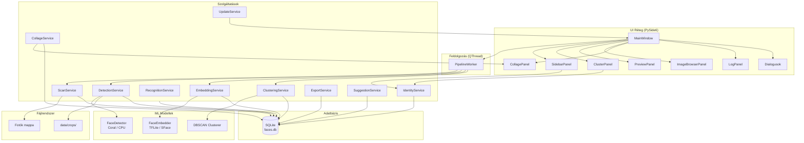
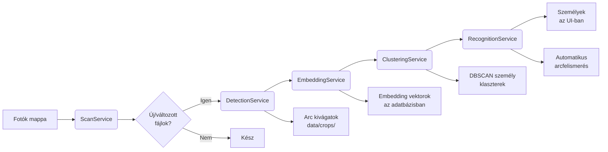
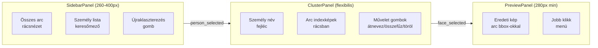
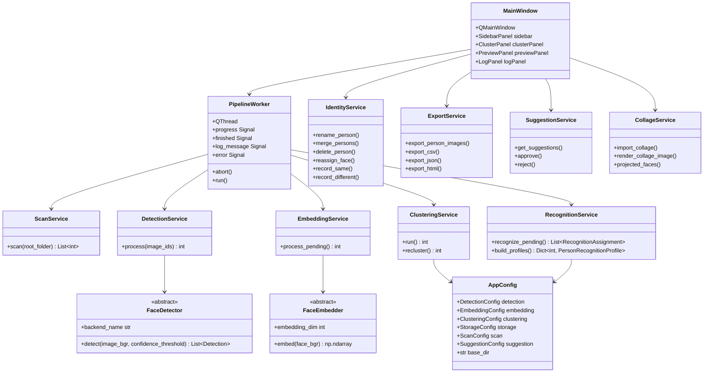

# Face-Local Blueprint

Teljes alkalmazás architektúra dokumentáció.

## 1. Áttekintés

Face-Local egy **asztali GUI alkalmazás** arcok offline detektálására, beágyazására (embedding), klaszterezésére és személyek címkézésére fotógyűjteményekben. Teljes egészében lokálisan fut, SQLite adatbázist és PySide6 Qt alapú UI-t használ.

### Fő jellemzők

- **Nyelv**: Python 3.11+
- **GUI Keretrendszer**: PySide6 (Qt bindings)
- **Adatbázis**: SQLite SQLAlchemy ORM-mel, WAL módban
- **Arc Detektálás**: OpenCV DNN (res10 SSD) vagy Coral Edge TPU (ssd_mobilenet_v2_quant)
- **Arc Beágyazás**: TFLite MobileFaceNet (192-dim) vagy SFace OpenCV-n keresztül (128-dim, ONNX)
- **Klaszterezés**: scikit-learn DBSCAN koszinusz távolsággal
- **Képfeldolgozás**: OpenCV (cv2)
- **Konfiguráció**: YAML fájl
- **Platformok**: macOS, Windows, Linux (x64 és ARM64)
- **Licenc**: HunKon Personal Use License v1.0

---

## 2. Architektúra diagram



### Feldolgozási pipeline adatfolyam



### 3-paneles UI elrendezés



### Adatbázis séma (kapcsolatokkal)

```mermaid
erDiagram
    IMAGES ||--o{ FACES : contains
    PERSONS ||--o{ FACES : classified_as
    FACES ||--o{ FACE_CORRECTIONS : correction_a
    FACES ||--o{ FACE_CORRECTIONS : correction_b
    COLLAGES ||--o{ COLLAGE_NODES : contains
    IMAGES ||--o{ COLLAGE_NODES : referenced_by

    IMAGES {
        int id PK
        text file_path UNIQUE
        text file_hash
        float file_mtime
        int width
        int height
        bool detection_done
        bool embedding_done
    }

    FACES {
        int id PK
        int image_id FK
        int person_id FK
        int bbox_x
        int bbox_y
        int bbox_w
        int bbox_h
        float confidence
        text detector_backend
        text crop_path
        blob _embedding
        bool is_excluded
    }

    PERSONS {
        int id PK
        text name
        bool is_auto_named
        text thumbnail_path
        text notes
    }

    FACE_CORRECTIONS {
        int id PK
        int face_id_a FK
        int face_id_b FK
        bool same_person
    }

    COLLAGES {
        int id PK
        text collage_uid
        text source_file UNIQUE
        text album_title
        int format_width
        int format_height
    }

    COLLAGE_NODES {
        int id PK
        int collage_id FK
        int image_id FK
        text node_uid
        float rel_x
        float rel_y
        float rel_w
        float rel_h
        float theta
        float scale
        text src_raw
        text src_resolved
        bool src_missing
    }
```

### Teljes osztály diagram



---

## 3. Belépési pont

**Fájl**: `app/main.py`

```bash
python -m app.main                      # alapértelmezett config
python -m app.main --config config.yaml # explicit config
python -m app.main --debug              # részletes naplózás
python -m app.main --db /tmp/test.db    # adatbázis út felülírása
```

### Indítási folyamat

1. CLI argumentumok feldolgozása (`argparse`)
2. Naplózás beállítása (`app.logging_setup.setup_logging`)
3. Konfiguráció betöltése (`app.config.load_config`)
4. i18n fordítások betöltése (`app.ui.i18n.load_prefs`)
5. QApplication létrehozása Catppuccin Mocha dark palettával
6. `MainWindow` létrehozása és megjelenítése
7. Esemény ciklus indítása (`app.exec()`)

---

## 4. Konfigurációs rendszer

**Fájl**: `app/config.py`

### AppConfig felépítése

| Mező | Típus | Leírás |
|------|-------|--------|
| `base_dir` | `str` | Feloldott elérési út alap |
| `detection` | `DetectionConfig` | Detektálás beállítások |
| `embedding` | `EmbeddingConfig` | Beágyazás beállítások |
| `clustering` | `ClusteringConfig` | Klaszterezés beállítások |
| `recognition` | `RecognitionConfig` | Arcfelismerés beállítások |
| `storage` | `StorageConfig` | Tárolás beállítások |
| `scan` | `ScanConfig` | Szkennelés beállítások |
| `suggestion` | `SuggestionConfig` | Javaslat beállítások |

### Részletes konfigurációk

```python
DetectionConfig
├── confidence_threshold: float = 0.65
├── min_face_size: int = 50
├── coral_model_path: Optional[str]
├── cpu_model_path: Optional[str]
└── cpu_model_input_size: tuple = (300, 300)

EmbeddingConfig
├── model_path: Optional[str]
├── input_size: tuple = (112, 112)
└── embedding_dim: int = 192

ClusteringConfig
├── epsilon: float = 0.4
├── min_samples: int = 2
└── metric: str = "cosine"

RecognitionConfig
├── auto_assign_threshold: float = 0.75
├── min_margin: float = 0.1
├── min_examples_per_person: int = 2
├── centroid_weight: float = 0.5
├── use_recognized_faces_for_training: bool = False
└── profile_auto_min_confidence: float = 0.8

StorageConfig
├── crops_dir: str = "data/crops"
└── db_path: str = "data/faces.db"

ScanConfig
├── image_extensions: list = [".jpg", ".jpeg", ".png", ".webp"]
├── worker_threads: int = 2
└── thumbnail_size: tuple = (128, 128)

SuggestionConfig
└── similarity_threshold: float = 0.5
```

### Konfiguráció betöltési sorrend

1. Explicit `--config` CLI argumentum
2. `FACE_LOCAL_CONFIG` környezeti változó
3. Automatikus keresés: `config.yaml`, majd `config.example.yaml`
4. Frozen (PyInstaller) módban felhasználói config könyvtár

Minden relatív elérési út a `config.yaml` szülőkönyvtárához képest oldódik fel (frozen módban a `bundle_root`-hoz, fallbackként `user_data_dir`).

---

## 5. Adatbázis séma

**Fájlok**: `app/db/models.py`, `app/db/database.py`

### Táblák

#### `images` — Szkennelt képfájlok

| Oszlop | Típus | Leírás |
|--------|-------|--------|
| `id` | INTEGER PK | Auto-increment |
| `file_path` | TEXT UNIQUE | Abszolút elérési út |
| `file_hash` | VARCHAR(64) | SHA-256 hash |
| `file_mtime` | FLOAT | `os.path.getmtime()` |
| `width` | INTEGER | Kép szélesség pixelben |
| `height` | INTEGER | Kép magasság pixelben |
| `detection_done` | BOOLEAN | Detektálás kész |
| `embedding_done` | BOOLEAN | Beágyazás kész |
| `created_at` | DATETIME | Létrehozás időpontja |
| `updated_at` | DATETIME | Utolsó módosítás |

**Kapcsolatok**: `faces` (one-to-many, cascade delete)

#### `faces` — Detektált arcok

| Oszlop | Típus | Leírás |
|--------|-------|--------|
| `id` | INTEGER PK | Auto-increment |
| `image_id` | INTEGER FK | `images.id` |
| `person_id` | INTEGER FK | `persons.id` (nullable) |
| `bbox_x/y/w/h` | INTEGER | Határoló doboz az eredeti képen |
| `confidence` | FLOAT | Detektálás biztonság [0.0-1.0] |
| `detector_backend` | VARCHAR(32) | `"coral"` vagy `"cpu"` |
| `crop_path` | TEXT | Arc indexkép elérési út |
| `_embedding` | BLOB | Szerializált float32 numpy tömb |
| `is_excluded` | BOOLEAN | Kizárva a klaszterezésből |
| `assignment_source` | VARCHAR(32) | Az arc hozzárendelésének forrása (`"manual"`, `"recognition"`, `"suggestion_approved"`) |
| `assignment_confidence` | FLOAT | A hozzárendelés bizalmi szintje [0.0-1.0] |
| `assigned_at` | DATETIME | A hozzárendelés időpontja |
| `created_at` | DATETIME | Létrehozás időpontja |

**Segéd metódusok**:
- `Face.get_embedding() -> Optional[np.ndarray]`
- `Face.set_embedding(vector: np.ndarray) -> None`

#### `persons` — Személyek

| Oszlop | Típus | Leírás |
|--------|-------|--------|
| `id` | INTEGER PK | Auto-increment |
| `name` | VARCHAR(255) | Személy neve |
| `is_auto_named` | BOOLEAN | Automatikus név (pl. "Ismeretlen 1") |
| `is_protected` | BOOLEAN | Védett személy (nem módosítható automatikus felismeréssel) |
| `thumbnail_path` | TEXT | Reprezentatív arc indexkép |
| `notes` | TEXT | Felhasználói jegyzetek |
| `created_at` | DATETIME | Létrehozás időpontja |
| `updated_at` | DATETIME | Utolsó módosítás |

#### `face_corrections` — Kézi korrekciók

| Oszlop | Típus | Leírás |
|--------|-------|--------|
| `id` | INTEGER PK | Auto-increment |
| `face_id_a` | INTEGER FK | Első arc |
| `face_id_b` | INTEGER FK | Második arc |
| `same_person` | BOOLEAN | `True`=ugyanaz, `False`=különböző |
| `created_at` | DATETIME | Létrehozás időpontja |

**Megszorítás**: UNIQUE(face_id_a, face_id_b)

#### `collages` — Picasa kollázsok

| Oszlop | Típus | Leírás |
|--------|-------|--------|
| `id` | INTEGER PK | Auto-increment |
| `collage_uid` | VARCHAR(64) | Picasa album UID |
| `source_file` | TEXT UNIQUE | .cxf/.cfx fájl elérési út |
| `album_title` | TEXT | Album címe |
| `album_date` | VARCHAR(128) | Album dátuma |
| `format_width` | INTEGER | Vászon szélesség |
| `format_height` | INTEGER | Vászon magasság |
| `orientation` | VARCHAR(32) | "landscape" vagy "portrait" |
| `bg_color` | VARCHAR(16) | Háttérszín |
| `spacing` | FLOAT | Node-ok távolsága |
| `created_at` | DATETIME | Létrehozás időpontja |
| `updated_at` | DATETIME | Utolsó módosítás |

#### `collage_nodes` — Kollázs node-ok (fotók)

| Oszlop | Típus | Leírás |
|--------|-------|--------|
| `id` | INTEGER PK | Auto-increment |
| `collage_id` | INTEGER FK | `collages.id` |
| `node_uid` | VARCHAR(64) | Node UID XML-ből |
| `rel_x/y/w/h` | FLOAT | Normalizált koordináták [0,1] |
| `theta` | FLOAT | Forgatás radiánban |
| `scale` | FLOAT | Picasa zoom skála |
| `theme` | VARCHAR(64) | Picasa téma név |
| `src_raw` | TEXT | Eredeti elérési út XML-ből |
| `src_resolved` | TEXT | Feloldott abszolút elérési út |
| `src_missing` | BOOLEAN | Hiányzó fájl |
| `image_id` | INTEGER FK | `images.id` (nullable) |
| `year/location/event_name/notes` | TEXT | Metaadatok |
| `created_at/updated_at` | DATETIME | Időbélyegek |

**Metódusok**:
- `CollageNode.pixel_bbox(collage_w, collage_h) -> (px, py, pw, ph)`

### Adatbázis inicializálás

```python
# SQLite WAL móddal
init_db(db_path: Path) -> Engine
get_engine() -> Engine
get_session() -> Session
session_scope() -> Generator[Session]  # auto commit/rollback
```

---

## 6. Core szolgáltatások

### 6.1 ScanService

**Fájl**: `app/services/scan_service.py`

**Felelősség**: Képfájlok felderítése és indexelése az adatbázisban.

**Folyamat**:
1. Rekurzív fájl enumeráció megfelelő kiterjesztésekkel
2. Minden fájlra:
   - Ellenőrzi, hogy létezik-e már az adatbázisban
   - Ha létezik azonos mtime-mal és `detection_done=True` → kihagyja
   - Különben SHA-256 hash számítás
   - Ha a hash változott → feldolgozási flag-ek resetelése
   - Ha új fájl → rekord beszúrása
3. Visszaadja a feldolgozandó kép ID-k listáját

**Segédfüggvények**:
- `hash_file(path: Path) -> str` — SHA-256, 4MB chunk-okban
- `discover_images(root: Path, extensions: List[str]) -> Generator[Path]`

### 6.2 DetectionService

**Fájl**: `app/services/detection_service.py`

**Felelősség**: Arc detektálás futtatása képeken, arc rekordok és kivágatok mentése.

**Folyamat**:
1. Minden kép ID-ra:
   - Kép betöltése OpenCV-vel (`cv2.imread`)
   - Detektor futtatása (`detector.detect()`)
   - Meglévő arc rekordok törlése a képhez
   - Minden detektáláshoz:
     - Arc kivágat mentése (`save_face_crop`)
     - `Face` rekord létrehozása az adatbázisban
   - Kép jelölése `detection_done=True`

**TPU fallback**: Ha a Coral meghibásodik, CPU detektorra vált.

### 6.3 EmbeddingService

**Fájl**: `app/services/embedding_service.py`

**Felelősség**: Beágyazási vektorok generálása arcokhoz.

**Folyamat**:
1. Lekérdezi az összes arcot ahol `_embedding IS NULL` és `is_excluded=False`
2. Minden archoz:
   - Kivágat betöltése
   - Embedder futtatása (`embedder.embed(img_bgr)`)
   - Beágyazás tárolása
3. Commit minden 50 arc után

### 6.4 ClusteringService

**Fájl**: `app/services/clustering_service.py`

**Felelősség**: Arcok csoportosítása személy klaszterekbe DBSCAN segítségével.

**Folyamat**:
1. Összes beágyazott, nem kizárt arc betöltése
2. Kézi korrekciók betöltése (`same_pairs`, `diff_pairs`)
3. `cluster_embeddings()` futtatása (DBSCAN)
4. Címkék leképezése Person rekordokra:
   - Minden egyedi címke → Person rekord
   - -1 címke (zaj) → egyedi singleton Person
   - "Ismeretlen N" elnevezés
5. `face.person_id` hozzárendelése
6. Orphan (árva) automatikus Person rekordok törlése

### 6.5 RecognitionService

**Fájl**: `app/services/recognition_service.py`

**Felelősség**: Automatikus arcfelismerés tanult személyi profilokból. Hozzárendeli az ismeretlen arcokat az ismert személyekhez magas magabiztossággal.

**Folyamat**:
1. Tanult profilok felépítése az ismert (nem automatikus) személyekből
   - Minden nevesített személy centroidjának és beágyazási vektorainak számítása
   - Csak megbízható forrásból (kézi vagy jóváhagyott) származó arcok használata
2. Feldolgozandó arcok betöltése (beágyazott, nem kizárt)
3. Egyes arcok illesztése a profilokra
   - Centroid + legjobb szomszéd hasonlóság keveréke
   - Küszöbértékek: `auto_assign_threshold` és `min_margin`
   - Kézi korrekciók betöltése és alkalmazása
4. Automatikus hozzárendelések rögzítése (`assignment_source="recognition"`)

**Adatosztályok**:
- `PersonRecognitionProfile` — centroid, példák, arc szám
- `RecognitionAssignment` — arc ID, cél személy, pontszám, margó

### 6.6 IdentityService

**Fájl**: `app/services/identity_service.py`

**Felelősség**: Felhasználói műveletek Person klasztereken.

**Metódusok**:
- `rename_person(person_id, new_name)` — átnevezés
- `merge_persons(source_id, target_id)` — összefűzés (forrás törléssel)
- `delete_person(person_id)` — törlés
- `reassign_face(face_id, target_person_id)` — áthelyezés
- `remove_face_from_cluster(face_id)` — eltávolítás (is_excluded=True)
- `exclude_face(face_id)` — kizárás
- `record_same(face_id_a, face_id_b)` — azonosnak jelölés
- `record_different(face_id_a, face_id_b)` — különbözőnek jelölés
- `list_persons(named_only, search)` — személyek listázása
- `get_faces_for_person(person_id)` — arcok lekérése

### 6.7 ExportService

**Fájl**: `app/services/export_service.py`

**Felelősség**: Arc képek és metaadatok exportálása.

**Metódusok**:
- `export_person_images()` — arc kivágatok/eredeti képek másolása
- `export_csv()` — strukturált CSV jelentés
- `export_json()` — JSON jelentés
- `export_html()` — statikus HTML galéria
- `export_collage_html()` — kollázs HTML galéria

### 6.8 SuggestionService

**Fájl**: `app/services/suggestion_service.py`

**Felelősség**: Centroid-alapú profil egyeztetés ismeretlen személyekhez.

**Folyamat**:
1. Ismeretlen személy centroid számítása
2. Nevesített személy centroid-okkal koszinusz hasonlóság összehasonlítás
3. Rangsorolt `Suggestion` lista visszaadása
4. `approve()` — ismeretlen beolvasztása a nevesített személybe
5. `reject()` — `FaceCorrection` (same_person=False) rögzítése

### 6.9 CollageService

**Fájl**: `app/services/collage_service.py`

**Felelősség**: Picasa kollázs importálás és renderelés.

**Metódusok**:
- `import_collage(file_path, search_roots, overwrite)` — XML import
- `relink_images(collage_id)` — node-ok újrakapcsolása Image rekordokhoz
- `get_faces_for_node(node)` — arc lekérés node-hoz
- `projected_faces(collage, render_w, render_h)` — arc vetítés
- `render_collage_image()` — annotált kollázs renderelés
- `export_annotated_collage()` — exportálás

### 6.10 CollageParser

**Fájl**: `app/services/collage_parser.py`

**Felelősség**: Picasa .cxf/.cfx XML fájlok feldolgozása.

**Adatosztályok**: `CollageNodeData`, `CollageData` (ORM nélkül)

**Függvények**:
- `parse_collage_file(file_path, search_roots) -> CollageData`
- `project_face_to_collage(face_bbox, img_w, img_h, node, collage_w, collage_h) -> Optional[tuple]`

**Elérési út feloldási stratégia**:
1. Pontos elérési út próbálása (Windows/Wine)
2. `[X]\` meghajtó előtag eltávolítása, relatív út a kollázs könyvtárához
3. Gyakori POSIX mount pontok próbálása
4. `search_roots` próbálása
5. Fájlnév-alapú keresés

### 6.11 UpdateService

**Fájl**: `app/services/update_service.py`

**Felelősség**: GitHub release ellenőrzés, letöltés, frissítés alkalmazása.

**Metódusok**:
- `check_for_updates()` — GitHub API hívás
- `download_update()` — asset letöltés
- `apply_update()` — platform-specifikus frissítés

---

## 7. ML Detektorok

**Fájl**: `app/detectors/base.py`

### Interfész

```python
class FaceDetector(ABC):
    @property
    def backend_name(self) -> str: ...

    @abstractmethod
    def detect(image_bgr: np.ndarray, confidence_threshold: float) -> List[Detection]: ...

@dataclass
class Detection:
    x: int
    y: int
    w: int
    h: int
    confidence: float
```

### Implementációk

| Osztály | Fájl | Leírás |
|---------|------|--------|
| `CoralDetector` | `app/detectors/coral_detector.py` | Coral EdgeTPU (ai-edge-litert vagy pycoral, libedgetpu delegate) |
| `CpuDetector` | `app/detectors/cpu_detector.py` | OpenCV DNN (res10 SSD) + MediaPipe fallback |

### Factory

**Fájl**: `app/detectors/factory.py`

```python
create_detector(config: DetectionConfig) -> FaceDetector
probe_coral() -> bool
_find_edgetpu_lib() -> Optional[Path]
```

A factory először Coralt próbál, sikertelenség esetén CPU-ra esik vissza.

---

## 8. ML Embedderek

**Fájl**: `app/embeddings/base.py`

### Interfész

```python
class FaceEmbedder(ABC):
    @property
    def embedding_dim(self) -> int: ...
    @abstractmethod
    def embed(face_bgr: np.ndarray) -> np.ndarray: ...
```

### Implementációk

| Osztály | Fájl | Kimenet | Bemenet | Leírás |
|---------|------|---------|---------|--------|
| `TFLiteEmbedder` | `app/embeddings/tflite_embedder.py` | 192-dim | 112x112 RGB | MobileFaceNet TFLite + HOG+PCA fallback |
| `SFaceEmbedder` | `app/embeddings/sface_embedder.py` | 128-dim | 112x112 grayscale | SFace OpenCV-n keresztül (ONNX) |

---

## 9. Klaszterezés

**Fájl**: `app/clustering/clusterer.py`

```python
cluster_embeddings(
    face_ids: List[int],
    embeddings: List[np.ndarray],
    epsilon: float,
    min_samples: int,
    metric: str = "cosine",
    same_pairs: Optional[List[tuple]] = None,
    diff_pairs: Optional[List[tuple]] = None
) -> Dict[int, int]
```

**Folyamat**:
1. Embedding mátrix stackelése, L2-normalizálás
2. DBSCAN futtatás (`eps=epsilon`, `min_samples=min_samples`, `metric=metric`)
3. Kézi megszorítások alkalmazása (`same_pairs` összefűz, `diff_pairs` szétválaszt)
4. Eredmény: `{face_id: cluster_label}` leképzés

**Segédfüggvények**:
- `compute_centroid(embeddings) -> np.ndarray`
- `cosine_distance(a, b) -> float`

---

## 10. Feldolgozási Pipeline

**Fájl**: `app/workers/pipeline_worker.py`

**Osztály**: `PipelineWorker(QThread)`

Háttérszálon fut, hogy a GUI reszponzív maradjon.

### Signálok

| Signal | Paraméterek | Leírás |
|--------|-------------|--------|
| `progress` | `(int current, int total, str stage, str detail)` | Előrehaladás |
| `log_message` | `(str message)` | Napló üzenet |
| `finished` | `(bool success, str summary)` | Befejezés |
| `error` | `(str message)` | Hiba |

### Pipeline szakaszok

```
Felhasználó kiválaszt egy mappát → Scan gomb
        │
        ▼
PipelineWorker.start()
        │
        ├── Stage 1: Scan ──────────────────────────────────────
        │     ScanService.scan(root_folder)
        │     → új/módosult kép ID-k listája
        │
        ├── Stage 2: Detection ─────────────────────────────────
        │     FaceDetector létrehozása (Coral/CPU)
        │     DetectionService.process(image_ids)
        │     → arc rekordok + kivágatok
        │
        ├── Stage 3: Embedding ─────────────────────────────────
        │     FaceEmbedder létrehozása (TFLite/SFace)
        │     EmbeddingService.process_pending()
        │     → embedding vektorok
        │
        ├── Stage 4: Clustering ────────────────────────────────
        │     ClusteringService.run()
        │     → Person rekordok + hozzárendelések
        │
        ├── Stage 5: Recognition ───────────────────────────────
        │     RecognitionService.recognize_pending()
        │     → automatikus arcok hozzárendelése az ismert személyekhez
        │
        ▼
finished(success, summary) signal
        │
        ▼
UI frissítés: SidebarPanel.populate()
```

---

## 11. UI Architektúra

### MainWindow

**Fájl**: `app/ui/main_window.py`

**Osztály**: `MainWindow(QMainWindow)`

**Elrendezés**:
- **Toolbar**: Művelet gombok (mappa kiválasztás, szkennelés, export, beállítások, kollázs)
- **Központi**: QTabWidget két lappal:
  - Tab 0: "Arcfelismerés" — 3-panel layout
  - Tab 1: "Kollázs" — CollagePanel
- **Dock**: LogPanel alul
- **Status bar**: Progress bar + státusz szöveg

### 3-Panel Layout

```
┌─────────────────┬───────────────────────────┬──────────────────┐
│  SidebarPanel   │     ClusterPanel          │  PreviewPanel    │
│  (260-400px)    │     (flexibilis)          │  (280px min)     │
│                 │                           │                  │
│  Összes arc     │  [Személy név fejléc]     │  [Kép preview   │
│  (indexkép      │  [Arc thumbnails          │   arc bbox-okkal │
│   rács)         │   rácsban]                │   + nevek]       │
│                 │                           │                  │
│  Keresőmező     │  [Művelet gombok]         │  [Jobb klikk:    │
│  Személy lista  │   - Átnevezés             │   megnyitás,     │
│                 │   - Összefűzés            │   nagyítás]      │
│  [Újra-         │   - Törlés                │                  │
│   klaszterezés] │   - Arc eltávolítása      │                  │
│                 │                           │                  │
└─────────────────┴───────────────────────────┴──────────────────┘
```

### Panel-ek

| Panel | Fájl | Feladat |
|-------|------|---------|
| **SidebarPanel** | `app/ui/panels/sidebar_panel.py` | Személy lista, keresés, arc előnézet |
| **ClusterPanel** | `app/ui/panels/cluster_panel.py` | Arcok rácsban kiválasztott személyhez |
| **PreviewPanel** | `app/ui/panels/preview_panel.py` | Eredeti kép + arc bbox-ok + jobb klikk menü |
| **ImageBrowserPanel** | `app/ui/panels/image_browser_panel.py` | Összes kép böngészése arc annotációkkal |
| **CollagePanel** | `app/ui/panels/collage_panel.py` | Picasa kollázs nézegető, zoomolható |
| **LogPanel** | `app/ui/panels/log_panel.py` | Színes napló, törlés gomb |

### Signal folyam

1. SidebarPanel `person_selected(person_id)` → ClusterPanel mutatja a személy arcait
2. ClusterPanel `face_selected(face_id)` → PreviewPanel betölti az eredeti képet + bbox-ot
3. PipelineWorker `progress(current, total, stage, detail)` → státusz sáv
4. PipelineWorker `finished(success, summary)` → UI frissítés + értesítés

### Dialógusok

| Dialógus | Fájl | Feladat |
|----------|------|---------|
| **RenameDialog** | `app/ui/dialogs/rename_dialog.py` | Személy átnevezése |
| **MergeDialog** | `app/ui/dialogs/merge_dialog.py` | Személyek összefűzése |
| **SettingsDialog** | `app/ui/dialogs/settings_dialog.py` | Nyelv, DB útvonal, auto-update, TPU teszt |
| **SuggestionDialog** | `app/ui/dialogs/suggestion_dialog.py` | Javaslatok elfogadása/elutasítása |
| **ExportDialog** | `app/ui/dialogs/export_dialog.py` | Export formátum választás |
| **UpdateDialog** | `app/ui/dialogs/update_dialog.py` | Frissítés letöltés/telepítés |
| **TpuStatusDialog** | `app/ui/dialogs/tpu_status_dialog.py` | TPU állapot, automatikus javítás |
| **PersonInfoDialog** | `app/ui/dialogs/person_info_dialog.py` | Személy adatok szerkesztése |
| **ManualFaceDialog** | `app/ui/dialogs/manual_face_dialog.py` | Kézi arc jelölés |
| **CollageNodeDialog** | `app/ui/dialogs/collage_node_dialog.py` | Kollázs node metaadatok |

### i18n Rendszer

**Fájl**: `app/ui/i18n.py`

- `t(key, **kwargs) -> str` — fordítás kulcs alapján
- `load_prefs() -> None` — nyelvi preferencia betöltése QSettings-ből
- Két nyelv: Angol (alapértelmezett) és Magyar
- Minden UI szöveg `t()`-n keresztül megy

### Téma

**Fájl**: `app/ui/theme.py`

- Catppuccin Mocha dark téma
- `QPalette` beállítás + QSS string alkalmazás

---

## 12. Segédmodulok

### image_utils

**Fájl**: `app/utils/image_utils.py`

- `load_image_bgr(path) -> np.ndarray` — kép betöltés OpenCV-vel
- `save_face_crop(img_bgr, detection, crops_dir, image_id, thumbnail_size, face_index) -> str` — arc kivágat mentés
- `save_image_bgr(path, img_bgr) -> None` — kép mentés

### paths

**Fájl**: `app/paths.py`

- `is_frozen() -> bool` — PyInstaller csomagolt mód?
- `bundle_root() -> Path` — alkalmazás bundle könyvtár
- `resource_path(relative_path) -> Path` — erőforrás elérés (frozen/modul)
- `user_data_dir() -> Path` — felhasználói adatkönyvtár
- `user_config_dir() -> Path` — felhasználói config könyvtár
- `project_root() -> Path` — projekt gyökér

### logging_setup

**Fájl**: `app/logging_setup.py`

- Rotating file handler + stderr handler
- `QLogHandler` — Qt signálokkal naplózás a UI-ba
- Szintek: DEBUG, INFO, WARNING, ERROR

---

## 13. Tesztelés

**Könyvtár**: `tests/`

12 teszt fájl, mind `tmp_path` fixture-t használ izolált SQLite adatbázishoz:

| Teszt fájl | Mit tesztel | Sorok |
|------------|-------------|-------|
| `test_clustering.py` | cosine_distance, compute_centroid, DBSCAN cluster_embeddings | 82 |
| `test_clustering_service.py` | Orphan cleanup, recluster stabilitás | 92 |
| `test_collage_parser.py` | XML parse, path resolution, face projection | 338 |
| `test_config.py` | Relative path resolution, frozen bundle | 56 |
| `test_database.py` | Image/Face/Person CRUD, embedding roundtrip, cascade | 125 |
| `test_detection_service.py` | Face indexing dummy detektorral | 91 |
| `test_detectors.py` | Detection dataclass, factory fallback, interface | 81 |
| `test_post_buffer_release.py` | Buffer post text, channel select | 54 |
| `test_post_x_release.py` | X post text, length enforcement | 36 |
| `test_recognition_service.py` | Profil építés, arcok illesztése, jóváhagyás/elutasítás | (új) |
| `test_scan_service.py` | File discovery, hash dedup, mtime resume | 105 |
| `test_suggestion_service.py` | Centroid, suggestions, approve/reject | 284 |

---

## 14. ML Modellek

**Könyvtár**: `models/`

| Fájl | Forrás | Feladat | Bemenet | Kimenet |
|------|--------|---------|---------|---------|
| `deploy.prototxt` | OpenCV samples | CPU DNN face detector prototxt | 300x300 | detections |
| `res10_300x300_ssd_iter_140000.caffemodel` | OpenCV 3rdparty | CPU DNN face detector weights | 300x300 | detections |
| `ssd_mobilenet_v2_face_quant_postprocess_edgetpu.tflite` | Google Coral test data | Coral Edge TPU face detector | kvantált | detections |
| `sface.onnx` | OpenCV Zoo | Face recognition embedder | 112x112 grayscale | 128-dim |
| `mobilefacenet.tflite` | GitHub (auto-download) | MobileFaceNet embedder | 112x112 RGB | 192-dim |

Megjegyzés: `mobilefacenet.tflite` nincs verziókövetve (`.gitignore`). A `build_and_run.sh` letölti több mirrorról validációval.

---

## 15. Külső függőségek

### Core

| Csomag | Verzió | Használat |
|--------|--------|-----------|
| PySide6 | ≥6.5 | Qt GUI |
| SQLAlchemy | ≥2.0 | ORM |
| opencv-python | ≥4.8 | Képfeldolgozás |
| numpy | ≥1.24 | Tömb műveletek |
| scikit-learn | ≥1.3 | DBSCAN |
| Pillow | ≥10.0 | Kép betöltés |
| PyYAML | ≥6.0 | YAML config |
| tflite-runtime | ≥2.14 | TFLite modellek |
| ai-edge-litert | (opcionális) | Coral EdgeTPU |

---

## 16. Build & Disztribúció

### Script-ek

| Script | Platform | Feladat |
|--------|----------|---------|
| `scripts/build_and_run.sh` | Linux/macOS | Teljes környezet beállítás + indítás |
| `scripts/build_and_run.bat` | Windows (CMD) | Ugyanaz |
| `scripts/build_and_run.ps1` | Windows (PowerShell) | Ugyanaz |
| `scripts/package_app.py` | Minden | PyInstaller csomagolás |
| `scripts/build_linux_deb.sh` | Linux | `.deb` csomag |
| `scripts/build_windows_installer.iss` | Windows | Inno Setup `.exe` telepítő |
| `scripts/github_release.py` | CI | GitHub release + asset feltöltés |
| `scripts/post_buffer_release.py` | CI | Buffer posztolás |
| `scripts/post_x_release.py` | CI | X/Twitter posztolás |

### CI/CD Pipeline (GitHub Actions)

`.github/workflows/build-release.yml`

1. **pick-runner**: Ellenőrzi a self-hosted futókat
2. **prepare**: Patch verzió automatikus növelése
3. **build-macos**: `.dmg` telepítő
4. **build-windows**: `.exe` + `.zip`
5. **build-linux-arm64**: `.deb` + `.tar.gz`
6. **build-linux-x64**: `.deb` + `.tar.gz`
7. **release**: Asset-ek összegyűjtése + GitHub release
8. **post-to-buffer**: Kétnyelvű bejelentés posztolása

---

## 17. Főbb implementációs minták

### Adatbázis session minta

```python
with session_scope() as session:
    svc = SomeService(session, config)
    result = svc.do_work()
# auto-commit siker esetén, auto-rollback hiba esetén
```

### Progress callback minta

```python
def progress_cb(current: int, total: Optional[int], detail: str):
    pass  # UI frissítés
```

### Qt signal minta

```python
class PipelineWorker(QThread):
    progress = Signal(int, int, str, str)   # current, total, stage, detail
    finished = Signal(bool, str)            # success, summary
```

### Embedding tárolás

```python
# Tárolás
face._embedding = vector.astype(np.float32).tobytes()

# Visszaolvasás
vector = np.frombuffer(face._embedding, dtype=np.float32).copy()
```

---

## 18. Fejlesztői irányelvek (AGENT.md-ból)

- **Kétnyelvű UI**: Minden szöveg `t()`-n keresztül, angol és magyar fordítás szükséges
- **Zero-research, one-click fixes**: TPU dialógus mutatja a javító parancsokat auto-fix gombbal
- **Build script**: `build_and_run.sh` mindent kezel venv-től modell letöltésig
- **Tesztelés**: `pytest -v` a teljes teszt suite futtatásához
- **Kód konvenciók**: típus annotációk, docstring-ek, meglévő minták követése
